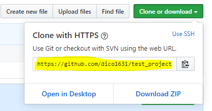

# CLI

> 커맨드 라인 인터페이스
>

#### 터미널 명령어들

- `cd ~` : 홈 디렉토리(directory=폴더)로 이동

- git log --oneline` : git의 log를 1줄로 보여줌

- `git remote` : 원격 저장소 별명을 알려줌

- `git remote -v` : 원격 저장소 별명과 주소까지 알려줌

  - `-v` : 말이 많은, 상세히 보여주는 코드

- `git remote rename [원래이름] [새이름]` : 원격저장소 이름 바꾸기

- `rm -r .git` : `git init`을 잘못했을 경우 지우는 방법

- `mv [이동할 파일] [이동할 위치]` : 파일이나 폴더 이동

  ```shell
  #origin이였던 원격저장소의 이름을 real로 바꿈
  student@M15035 MINGW64 ~/push_pull/multicampus/test (master)
  $ git remote rename origin real
  
  student@M15035 MINGW64 ~/push_pull/multicampus/test (master)
  $ git remote -v
  real    https://github.com/dico1631/test_project.git (fetch)
  real    https://github.com/dico1631/test_project.git (push)
  
  #real이였던 원격저장소의 이름을 origin으로 바꿈
  student@M15035 MINGW64 ~/push_pull/multicampus/test (master)
  $ git remote rename real origin
  
  student@M15035 MINGW64 ~/push_pull/multicampus/test (master)
  $ git remote -v
  origin  https://github.com/dico1631/test_project.git (fetch)
  origin  https://github.com/dico1631/test_project.git (push)
  
  ```

  


# 저번시간 복습하기!

> 매 단계에 `ls`, `git status`, `git log --oneline`  , `git remote -v` 로 상태 확인 필수

#### 1. Git에 파일 올리는 법

1. Git은 directory(폴더) 단위로 파일 관리하기에 빈 폴더 만들기

2. cd [폴더명] 으로 폴더로 이동

3. `git init` : Git 시작

   `(master)` 가 생김, Git으로 관리하는 directory (폴더)라는 의미

   `ls -a` 하면 `.git`라는 숨김 폴더가 생긴 걸 볼 수 있음.

4. `touch` [파일명] : Git에 올릴 파일 만들기

5. `git add` [파일명] : 파일을 사진대에 올림

6. `git commit -m "메세지"` : 사진대에 올린 파일을 스냅샷 찍기

   

#### 2. Github에 올리는 법

1. Github에서 New repository 만들기
2. 만든 repository에 주소 복사
3. `git remote add` [원격저장소 별명] [2에서 복사한 주소] : 폴더와 원격 저장소 연결
4.  `git push [원격저장소 별명] master` : Git의 파일을 원격저장소에 올림


- ​	Git으로 관리되고 있는 directory 안에는 **Git으로 관리되는** 또 다른 directory를 넣으면 **안된다.**

     이렇게 되어버리면 어떤 Git이 대장인지 알 수가 없기 때문에.

  ​    만일 Git으로 관리되는   directory 'A' 안에는 Git으로 관리되는 또 다른 directory 'B'를 넣고 싶다면,

  ​	`mv B A`로 B를 A로 옮기고, B의 Git을 `rm -r .git` 을 해서 지운다.


# 깃허브에 올린 파일 가져오기

> 방법 1. Github에서 zip 파일 다운받고 directory에 넣고 압축풀고... (귀찮..)
>
> 방법 2. Git clone 방법을 통해 자동으로 복사해서 해당 directory에 넣기!

### 1. clone  하기

> 학원에서 작업해서 github에 올려놓고 집에서 복습을 하려고 한다.
>
> 집에 도착한 다음에 다운을 받아보자!
>
> clone은 아예 처음 (폴더와 원격저장소에 연결조차 하지 않았을 때), 프로젝트 시작때만 한다. 
>
> 그 다음부터는 아래 나오는 pull을 한다.

1. 다운받을 directory (dir) 만들기

2. `git clone [복사한 clone 주소]` 

   

```shell
student@M15035 MINGW64 ~/push_pull/house
$ git clone https://github.com/dico1631/test_project.git
Cloning into 'test_project'...
remote: Enumerating objects: 5, done.
remote: Counting objects: 100% (5/5), done.
remote: Compressing objects: 100% (3/3), done.
remote: Total 5 (delta 0), reused 5 (delta 0), pack-reused 0
Unpacking objects: 100% (5/5), done.
```


#### clone이 되었는지 확인

1. ls`로 확인하면 원격저장소 별명 이름으로 폴더가 생김
2. `cd [dir 이름]` 으로 dir(폴더)에 들어가기
3. 그 dir에는 (master) 가 보이고`ls -a` 하면 `.git` 이라는 숨김 폴더가 생겨있을 것, Git으로 관리되는 dir이라는 것.
4. `git remote -v` 해보면 clone 했던 원격저장소와 dir이 연결되어 있음을 알 수 있음.

```shell
student@M15035 MINGW64 ~/push_pull/house
$ ls
test_project/

student@M15035 MINGW64 ~/push_pull/house
$ cd test_project/

student@M15035 MINGW64 ~/push_pull/house/test_project (master)
$ ls -a
./  ../  .git/  a.txt  b.txt

student@M15035 MINGW64 ~/push_pull/house/test_project (master)
$ git remote -v
origin  https://github.com/dico1631/test_project.git (fetch)
origin  https://github.com/dico1631/test_project.git (push)

```


### 2. 새 파일 만들어서 원격저장소에 넣어보기

> 집에서 복습을 하면서 수업내용을 정리해서 새 파일을 만들었다.
>
> 다시 이 파일을 원격저장소에 올려보자!

1. `touch`로 파일 만든다.
2. `add`, `commit`, `push` 로 원격저장소에 넣는다.

```shell
#파일 생성
student@M15035 MINGW64 ~/push_pull/house/test_project (master)
$ touch c.txt

student@M15035 MINGW64 ~/push_pull/house/test_project (master)
$ git status
On branch master
Your branch is up to date with 'origin/master'.

Untracked files:
  (use "git add <file>..." to include in what will be committed)
        c.txt

nothing added to commit but untracked files present (use "git add" to track)

#add
student@M15035 MINGW64 ~/push_pull/house/test_project (master)
$ git add c.txt

student@M15035 MINGW64 ~/push_pull/house/test_project (master)
$ git status
On branch master
Your branch is up to date with 'origin/master'.

Changes to be committed:
  (use "git restore --staged <file>..." to unstage)
        new file:   c.txt

#commit
student@M15035 MINGW64 ~/push_pull/house/test_project (master)
$ git commit -m "add c.txt"
[master 304a52a] add c.txt
 1 file changed, 0 insertions(+), 0 deletions(-)
 create mode 100644 c.txt

student@M15035 MINGW64 ~/push_pull/house/test_project (master)
$ git status
On branch master
Your branch is ahead of 'origin/master' by 1 commit.
  (use "git push" to publish your local commits)

nothing to commit, working tree clean

student@M15035 MINGW64 ~/push_pull/house/test_project (master)
$ git log
commit 304a52ac69933fcc4dea2d2ad4d1978e8a92fc26 (HEAD -> master)
Author: Min Jung <dicoqnfkrzl@naver.com>
Date:   Tue Dec 17 10:15:53 2019 +0900

    add c.txt

commit 1096a0e3f6631afd5b017981abefa26c4add31cd (origin/master, origin/HEAD)
Author: Min Jung <dicoqnfkrzl@naver.com>
Date:   Tue Dec 17 09:44:11 2019 +0900

    add b.txt

commit 30bd4d3ddd00163de5a8d51e849f484265a22c63
Author: Min Jung <dicoqnfkrzl@naver.com>
Date:   Tue Dec 17 09:41:29 2019 +0900

    first commit

#push
student@M15035 MINGW64 ~/push_pull/house/test_project (master)
$ git push origin master
Enumerating objects: 3, done.
Counting objects: 100% (3/3), done.
Delta compression using up to 8 threads
Compressing objects: 100% (2/2), done.
Writing objects: 100% (2/2), 242 bytes | 242.00 KiB/s, done.
Total 2 (delta 0), reused 0 (delta 0)
To https://github.com/dico1631/test_project.git
   1096a0e..304a52a  master -> master

```


### 3. '원격저장소에 이미 있는' 파일을 확인하기

> 다음날 학원에서 어제 집에서 만든 파일을 보고 싶다.
>
> 그 파일을 가져오자!
>
> clone은 제일 처음에 1번만 하는 것이고, 그 다음부터는 계속 이 방법으로 원격저장소의 내용을 가져온다.

1. `git log --oneline`을 해보면 새로 push 했던 파일이 뜨지 않는다.
2. 원격저장소에는 있지만 아직 학원 폴더에는 없기 때문에 원격저장소에서 가져와야함.
3. `git pull [원격저장소 별명] master`을 해서 원격저장소의 모든 내용을 가져온다.
4. `git log --oneline`을 해보면 새로 push 했던 파일이 뜬다.

```shell
#1. 확인
student@M15035 MINGW64 ~/push_pull/multicampus/test (master)
$ git log --oneline
1096a0e (HEAD -> master, origin/master) add b.txt
30bd4d3 first commit

#3. pull
student@M15035 MINGW64 ~/push_pull/multicampus/test (master)
$ git pull origin master
remote: Enumerating objects: 3, done.
remote: Counting objects: 100% (3/3), done.
remote: Compressing objects: 100% (2/2), done.
remote: Total 2 (delta 0), reused 2 (delta 0), pack-reused 0
Unpacking objects: 100% (2/2), done.
From https://github.com/dico1631/test_project
 * branch            master     -> FETCH_HEAD
   1096a0e..304a52a  master     -> origin/master
Updating 1096a0e..304a52a
Fast-forward
 c.txt | 0
 1 file changed, 0 insertions(+), 0 deletions(-)
 create mode 100644 c.txt

#4. 확인
student@M15035 MINGW64 ~/push_pull/multicampus/test (master)
$ git log --oneline
304a52a (HEAD -> master, origin/master) add c.txt
1096a0e add b.txt
30bd4d3 first commit

```

