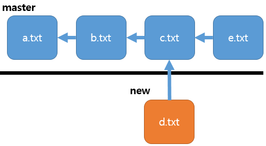
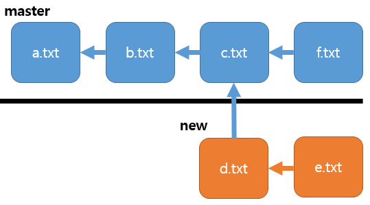
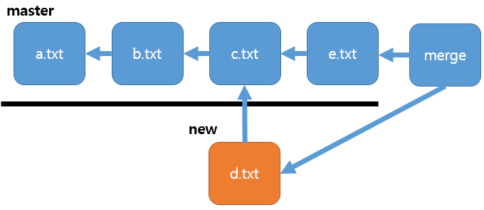
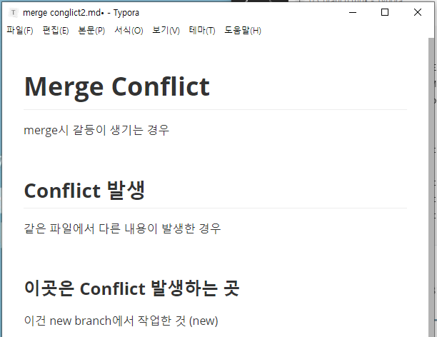
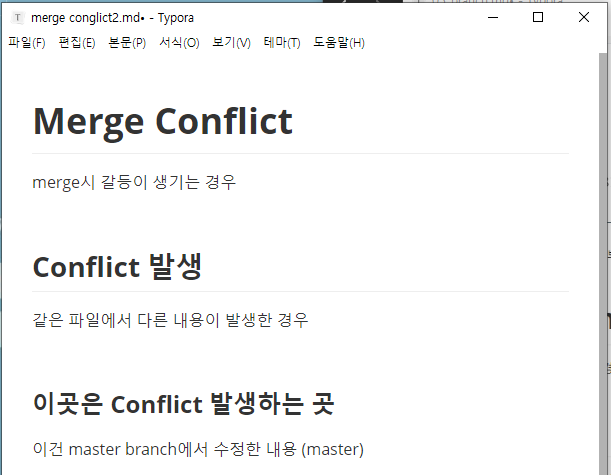
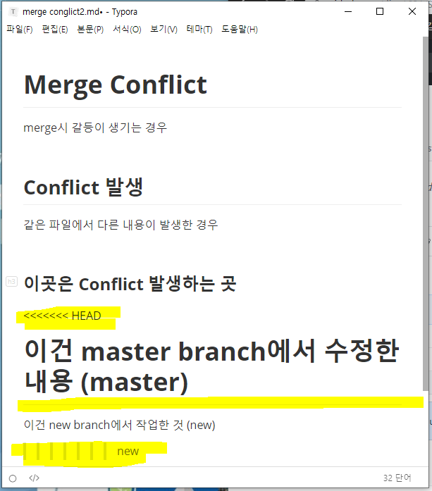

# CLI

> 커맨드 라인 인터페이스
>

#### 터미널 명령어들

- `git branch [새 branch 이름]` : 새로운 branch 만들기

- `git branch` : 만들어진 branch들의 리스트를 보기

- `git switch [새 branch 이름]` : 새로운 branch로 이동

  - git  의 최신 version에 새로 도입된 명령어
  - `git checkout [새 branch 이름]` : switch와 완전히 같은 역할인데, checkout 이라는 단어가 다른 기능에서도 사용되어서 헷갈려서 switch라는 새 명령어가 만들어 짐.

- `git push origin --delete [삭제할 branch명]`  : 이미 Github에 push 한 branch를 Github에서 지우는 방법

- `git merge new --no-ff` : fast-forward 상황이지만 강제로 Auto-merge 처럼 merge 한다.

- `git switch -c new` : branch 만들면서 바로 이동

  


# branch

`git init` 하면 생기는 `(master)`는 branch 중 하나이다.

  `git log`를 포함해 기존의 내용을 전혀 바꾸지 않고 어떤 걸 바꾸고 싶을 때,  새로운 세계를 하나 만든다.

이렇게 하면 여러 팀원들이 똑같은 상황을 clone하고 각자 마음대로 clone을 변경해도 push 할 수 있다.

이 기능 때문에 수십, 수천명이 같이 하나를 가지고 코딩을 할 수 있는 것이다.

## 1. branch 도식화

   

위는 master 아래는 new라는 다른 branch이다. 


## 2. branch 실습시작

##### 1. 준비

1. 새 폴더 branch 를 만든다.

2.  branch 폴더에서 `git init`을 한다.

3.  branch 'a.txt', 'b.txt', 'c.txt' 파일을 만든다.

4.  전부 `add`, `commit`을 한다.

   ```shell
   #1번
   student@M15035 MINGW64 ~
   $ mkdir branch
   
   student@M15035 MINGW64 ~
   $ cd branch
   
   #2번
   student@M15035 MINGW64 ~/branch
   $ git init
   Initialized empty Git repository in C:/Users/student/branch/.git/
   
   #3번
   student@M15035 MINGW64 ~/branch (master)
   $ touch a.txt
   
   student@M15035 MINGW64 ~/branch (master)
   $ touch b.txt
   
   student@M15035 MINGW64 ~/branch (master)
   $ touch c.txt
   
   student@M15035 MINGW64 ~/branch (master)
   $ ls
   a.txt  b.txt  c.txt
   
   student@M15035 MINGW64 ~/branch (master)
   $ git status
   On branch master
   
   No commits yet
   
   Untracked files:
     (use "git add <file>..." to include in what will be committed)
           a.txt
           b.txt
           c.txt
   
   nothing added to commit but untracked files present (use "git add" to track)
   
   #4번
   student@M15035 MINGW64 ~/branch (master)
   $ git add a.txt
   
   student@M15035 MINGW64 ~/branch (master)
   $ git commit -m "Add a.txt"
   [master (root-commit) 719fdbb] Add a.txt
    1 file changed, 0 insertions(+), 0 deletions(-)
    create mode 100644 a.txt
   
   student@M15035 MINGW64 ~/branch (master)
   $ git add b.txt
   
   student@M15035 MINGW64 ~/branch (master)
   $ git commit -m "Add b.txt"
   [master 23a176b] Add b.txt
    1 file changed, 0 insertions(+), 0 deletions(-)
    create mode 100644 b.txt
   
   student@M15035 MINGW64 ~/branch (master)
   $ git add c.txt
   
   student@M15035 MINGW64 ~/branch (master)
   $ git commit -m "Add c.txt"
   [master 8da4049] Add c.txt
    1 file changed, 0 insertions(+), 0 deletions(-)
    create mode 100644 c.txt
   
   student@M15035 MINGW64 ~/branch (master)
   $ git log --oneline
   8da4049 (HEAD -> master) Add c.txt
   23a176b Add b.txt
   719fdbb Add a.txt
   ```


##### 2. branch 만들기

1. `git branch new` 로 새 branch (new)를 만든다.
2. 새 branch 가 만들어졌는지 확인한다.

```shell
#새 branch를 만들기 전에는 (master) 밖에 없다.
student@M15035 MINGW64 ~/branch (master)
$ git branch
* master


#1번
student@M15035 MINGW64 ~/branch (master)
$ git branch new
#2번
student@M15035 MINGW64 ~/branch (master)
$ git branch
* master
  new  #새 branch (new)가 만들어졌다.
  # 만들었더라도 여전히 내가 있는 곳은 (master)이기에 새 branch로 가려면 이동을 해줘야 한다.
```


##### 3. branch 이동

```shell
student@M15035 MINGW64 ~/branch (master)
$ git switch new
Switched to branch 'new'

student@M15035 MINGW64 ~/branch (new)
$ git log
commit 8da4049adbad56ce0128ac9ac80925f46efb113f (HEAD -> new, master)
Author: Min Jung <dicoqnfkrzl@naver.com>
Date:   Tue Dec 17 14:38:05 2019 +0900
<생략>

student@M15035 MINGW64 ~/branch (new)
$ git switch master
Switched to branch 'master'

student@M15035 MINGW64 ~/branch (master)
$ git log --oneline
8da4049 (HEAD -> master, new) Add c.txt
23a176b Add b.txt
719fdbb Add a.txt

```

new를 a,b,c 만들고 나서 만들었기에  a,b,c 또한 new에서 사용 가능하다.

(HEAD -> new, master)

(HEAD -> master, new)

head 는 현 위치를 나타내는 포인터


**branch의 세계가 분리되어 있음을 알아보자**

##### 5. 각 branch에 파일 생성

```shell
student@M15035 MINGW64 ~/branch (master)
$ git switch new
Switched to branch 'new'

student@M15035 MINGW64 ~/branch (new)
$ touch d.txt

student@M15035 MINGW64 ~/branch (new)
$ git status
On branch new
Untracked files:
  (use "git add <file>..." to include in what will be committed)
        d.txt

nothing added to commit but untracked files present (use "git add" to track)

student@M15035 MINGW64 ~/branch (new)
$ git add d.txt

student@M15035 MINGW64 ~/branch (new)
$ git commit -m "d.txt"
[new ed8a737] d.txt
 1 file changed, 0 insertions(+), 0 deletions(-)
 create mode 100644 d.txt

student@M15035 MINGW64 ~/branch (new)
$ git log --oneline
ed8a737 (HEAD -> new) d.txt
8da4049 (master) Add c.txt
23a176b Add b.txt
719fdbb Add a.txt
#new에는 abcd 전부 있음
```

```shell
student@M15035 MINGW64 ~/branch (new)
$ git switch master
Switched to branch 'master'

student@M15035 MINGW64 ~/branch (master)
$ ls
a.txt  b.txt  c.txt

student@M15035 MINGW64 ~/branch (master)
$ git log --oneline
8da4049 (HEAD -> master) Add c.txt
23a176b Add b.txt
719fdbb Add a.txt
# master에는 new에서 만든 d가 없음
```

```shell
student@M15035 MINGW64 ~/branch (master)
$ touch e.txt

student@M15035 MINGW64 ~/branch (master)
$ git status
On branch master
Untracked files:
  (use "git add <file>..." to include in what will be committed)
        e.txt

nothing added to commit but untracked files present (use "git add" to track)

student@M15035 MINGW64 ~/branch (master)
$ git add e.txt

student@M15035 MINGW64 ~/branch (master)
$ git commit -m "Add e.txt"
[master 6fa4f7f] Add e.txt
 1 file changed, 0 insertions(+), 0 deletions(-)
 create mode 100644 e.txt

student@M15035 MINGW64 ~/branch (master)
$ git log --oneline
6fa4f7f (HEAD -> master) Add e.txt
8da4049 Add c.txt
23a176b Add b.txt
719fdbb Add a.txt
# master에서 만든 e는 나오는데 d는 없음
```

```shell
student@M15035 MINGW64 ~/branch (master)
$ git switch new
Switched to branch 'new'

student@M15035 MINGW64 ~/branch (new)
$ ls
a.txt  b.txt  c.txt  d.txt

student@M15035 MINGW64 ~/branch (new)
$ git log --oneline
ed8a737 (HEAD -> new) d.txt
8da4049 Add c.txt
23a176b Add b.txt
719fdbb Add a.txt

#new에는 new 상태일때 만든 d는 있지만, master 상태일 때 만든 e는 없다.
```


## 3. branch들 합치기 (merge)

> branch를 만들어서 코드를 고쳤다면 다 합쳐서 하나의 프로젝트로 만들어야 한다.

### Merge 시나리오 (3가지)

#### 1. Auto-Merge

 Merge 시점에 양쪽 브런치에 commit들이 쌓여있지만 서로 다른 파일들을 변경해서 (동일 파일을 여럿이 변경한 경우가 없어서) Conflict가 발생하지 않는 경우

0. 위의 실습 예제에서 이어서 한다.

1. 병합할 branch로 이동(병합 될 branch가 아님!)

   `git switch [합병할 branch]`

2. `get merge [병합될 branch 이동]`를 써서 합병

3. Esc 3번 누르고 `:wq`(write & quit이라는 의미)

4.  `git log --oneline`와 ` git log --oneline --graph`로 병합한 결과 확인하기

- 준비 화면

 

```shell
#1번
student@M15035 MINGW64 ~/branch (new)
$ git switch master
Switched to branch 'master'

#2번 / 입력하면 아래 코드 박스의 코드가 뜸
student@M15035 MINGW64 ~/branch (master)
$ git merge new
hint: Waiting for your editor to close the filMerge made by the 'recursive' strategy.
 d.txt | 0
 1 file changed, 0 insertions(+), 0 deletions(-)
 create mode 100644 d.txt

#3번하면 나오는 코드
student@M15035 MINGW64 ~/branch (master)
$ git log --oneline
c0041e6 (HEAD -> master) Merge branch 'new'
6fa4f7f Add e.txt
ed8a737 (new) d.txt
8da4049 Add c.txt
23a176b Add b.txt
719fdbb Add a.txt

#4번
student@M15035 MINGW64 ~/branch (master)
$ git log --oneline --graph
*   c0041e6 (HEAD -> master) Merge branch 'new'
|\
| * ed8a737 (new) d.txt
* | 6fa4f7f Add e.txt
|/
* 8da4049 Add c.txt
* 23a176b Add b.txt
* 719fdbb Add a.txt

student@M15035 MINGW64 ~/branch (master)
$ ls
a.txt  b.txt  c.txt  d.txt  e.txt

```

```shell
# 2번을 하면 뜨는 화면 / 3번하기


Merge branch 'new'
# Please enter a commit message to explain why this merge is necessary,
# especially if it merges an updated upstream into a topic branch.
#
# Lines starting with '#' will be ignored, and an empty message aborts
# the commit.
~
~
~
~
~
~
~
~
~
~
~
~
~
~
~
~
~
~
~
~
~
~
~
~
~
~
~
~
~
~
~
~
~
C:/Users/student/study/.git/MERGE_MSG [unix] (17:34 17/12/2019)                          1,1 모두

```


- 결과 도식화 

  

<video src="../Desktop/딥러닝 수업자료/001_branch merge.mp4"></video>


#### 1. Fast-Forward Merge

 브랜치 분기가 일어났지만, merge 시점에서 branch 한 쪽에만 commit들이 쌓여 있을 경우

(ex. new에만 commit이 있고, master에는 없었을 때)

#####  실습 준비

0. 위 실습에서 new branch를 지우고 이어서 한다.
   - `git branch -d [branch명]` : branch 지우기
1. README.md 라는 파일을 branch 폴더에 만든다.
2. `add`, `commit`
3. 새 branch 'neo'를 만들고 거기로 이동한다.
4.  README.md 라는 파일 열고 아무거나 글을 써서 변경 후 저장한다.
5. `add`, `commit`

##### 병합 시작

1. 병합할 branch로 이동(병합 될 branch가 아님!)

   `git switch [합병할 branch]`

2. `get merge [병합될 branch 이동]`를 써서 합병

3. 자동으로 Fast-forward을 함.

   - 변경된 내용이 기존 내용보다 높은 우선순위를 가져서 기존 내용을 덮어쓰기 한다.

 

```shell
##준비 0번
student@M15035 MINGW64 ~/branch (master)
$ git branch
* master

#준비 1번
student@M15035 MINGW64 ~/branch (master)
$ git add README.md

#준비 2번
student@M15035 MINGW64 ~/branch (master)
$ git commit -m "Add README.md"
[master 0f9bf40] Add README.md
 1 file changed, 16 insertions(+)
 create mode 100644 README.md

student@M15035 MINGW64 ~/branch (master)
$ git log --oneline
0f9bf40 (HEAD -> master) Add README.md
c0041e6 Merge branch 'new'
6fa4f7f Add e.txt
ed8a737 d.txt
8da4049 Add c.txt
23a176b Add b.txt
719fdbb Add a.txt

#준비 3번
student@M15035 MINGW64 ~/branch (master)
$ git branch neo

student@M15035 MINGW64 ~/branch (master)
$ git switch neo
Switched to branch 'neo'

##준비 4번 README.md 변경

#준비 5번
student@M15035 MINGW64 ~/branch (neo)
$ git add README.md

student@M15035 MINGW64 ~/branch (neo)
$ git commit -m "modify README.md (neo)"
[neo 0159645] modify README.md (neo)
 1 file changed, 1 insertion(+), 1 deletion(-)

#병합 1번
student@M15035 MINGW64 ~/branch (neo)
$ git switch master
Switched to branch 'master'

#병합 2번, 3번
student@M15035 MINGW64 ~/branch (master)
$ git merge new
Updating 0f9bf40..0159645
Fast-forward
 README.md | 2 +-
 1 file changed, 1 insertion(+), 1 deletion(-)

student@M15035 MINGW64 ~/branch (master)
$ git log --oneline
0159645 (HEAD -> master, neo) modify README.md (neo)
0f9bf40 Add README.md
c0041e6 Merge branch 'new'
6fa4f7f Add e.txt
ed8a737 d.txt
8da4049 Add c.txt
23a176b Add b.txt
719fdbb Add a.txt

student@M15035 MINGW64 ~/branch (master)
$ git log --oneline
0159645 (HEAD -> master, neo) modify README.md (neo)
0f9bf40 Add README.md
c0041e6 Merge branch 'new'
6fa4f7f Add e.txt
ed8a737 d.txt
8da4049 Add c.txt
23a176b Add b.txt
719fdbb Add a.txt

```


<video src="../Desktop/딥러닝 수업자료/002_fast-forward merge.mp4"></video>


#### 3. Merge Conflict 발생

 Merge 시점에 양쪽 브런치에 commit들이 쌓여 있고, conflict가 발생하는 경우

- 동일 파일을 여럿이 각자 변경해 동일 파일 내에 상충하는 내용이 있을 경우

##### 실습 준비

0. 위 실습에서 이어서 한다.
1. new branch를 생성 후 이동한다.
2.  README.md 라는 파일 열고 아무거나 글을 써서 변경 후 저장한다.
3. `add`, `commit`
4. `switch master`
5.  README.md 라는 파일 열고 아무거나 글을 써서 변경 후 저장한다.
6. `add`, `commit`

##### 병합 시작

1. 병합할 branch로 이동(병합 될 branch가 아님!)

   `git switch [합병할 branch]`

2. `get merge [병합될 branch 이동]`를 써서 합병

3. Merge conflict 발생 & Automatic merge 실패

   - 두 branch에서 같은 파일 (README.md)을 변경해서 충돌이 일어난 것. 
   - 변경사항 중 어떤 내용을 남길 지 정해야 한다.

4. README.md 파일을 열어서 아래쪽 사진의 작업을 진행

5. `add`, `commit` 하면 병합 성공

```shell
#준비 1번
student@M15035 MINGW64 ~/branch (master)
$ git switch -c new
Switched to a new branch 'new'

student@M15035 MINGW64 ~/branch (new)
$ git status
On branch new
Changes not staged for commit:
  (use "git add <file>..." to update what will be committed)
  (use "git restore <file>..." to discard changes in working directory)
        modified:   README.md

no changes added to commit (use "git add" and/or "git commit -a")

##준비 2번 README.md 변경

#준비 3번
student@M15035 MINGW64 ~/branch (new)
$ git add README.md

student@M15035 MINGW64 ~/branch (new)
$ git commit -m "modify README.md (new)"
[new c4b43a9] modify README.md (new)
 1 file changed, 1 insertion(+), 1 deletion(-)

#준비 4번
student@M15035 MINGW64 ~/branch (new)
$ git switch master
Switched to branch 'master'

student@M15035 MINGW64 ~/branch (master)
$ git status
On branch master
Changes not staged for commit:
  (use "git add <file>..." to update what will be committed)
  (use "git restore <file>..." to discard changes in working directory)
        modified:   README.md

no changes added to commit (use "git add" and/or "git commit -a")

##준비 5번 README.md 변경

#준비 6번
student@M15035 MINGW64 ~/branch (master)
$ git add README.md

student@M15035 MINGW64 ~/branch (master)
$ git commit -m "modify README.md (master)"
[master d09b175] modify README.md (master)
 1 file changed, 1 insertion(+), 1 deletion(-)

#병합 1번
student@M15035 MINGW64 ~/branch (new)
$ git switch master
Switched to branch 'master'

#병합 2번
student@M15035 MINGW64 ~/branch (master)
$ git merge new
Auto-merging README.md
CONFLICT (content): Merge conflict in README.md
Automatic merge failed; fix conflicts and then commit the result.

##병합 3번 README.md에서 지우기

#병합 4번
student@M15035 MINGW64 ~/branch (master|MERGING)
$ git add README.md

student@M15035 MINGW64 ~/branch (master|MERGIN
$ git commit -m "Resolve merge conflict"
[master b761b3d] Resolve merge conflict

student@M15035 MINGW64 ~/branch (master)
$ git log --oneline
b761b3d (HEAD -> master) Resolve merge conflic
d09b175 modify README.md (master)
c4b43a9 (new) modify README.md (new)
0159645 modify README.md (neo)
0f9bf40 Add README.md
c0041e6 Merge branch 'new'
6fa4f7f Add e.txt
ed8a737 d.txt
8da4049 Add c.txt
23a176b Add b.txt
719fdbb Add a.txt

student@M15035 MINGW64 ~/branch (master)
$ git log --oneline --graph
*   b761b3d (HEAD -> master) Resolve merge con
|\
| * c4b43a9 (new) modify README.md (new)
* | d09b175 modify README.md (master)
|/
* 0159645 modify README.md (neo)
* 0f9bf40 Add README.md
*   c0041e6 Merge branch 'new'
|\
| * ed8a737 d.txt
* | 6fa4f7f Add e.txt
|/
* 8da4049 Add c.txt
* 23a176b Add b.txt
* 719fdbb Add a.txt

```



- new branch에서 작업한 내용



- master branch에서 작업한 내용



- Conflict 뜨면서 바뀐 README.md

- 노란 부분을 지우고 "이건 master~(master)" 과  "이건 new~(new)" 2개 중 저장할 것만 남긴 다음 병합 4번으로 넘어간다.

  (2개 다 남기는 것도 가능)


#### Merge Conflict 를 막기위한 규칙

- 같은 파일을 여럿이 한번에 바꾸면 일어나는 문제
- 그러므로 최대한 같은 파일을 여럿이 변경하는 일이 없도록 한다.