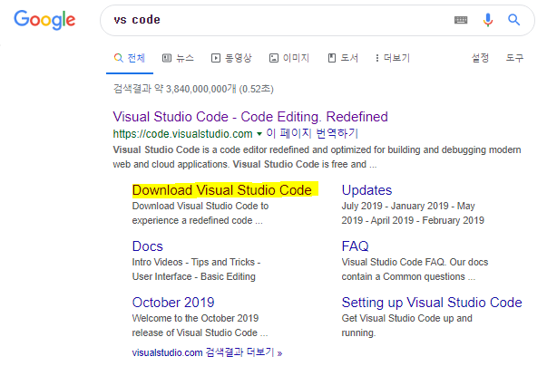
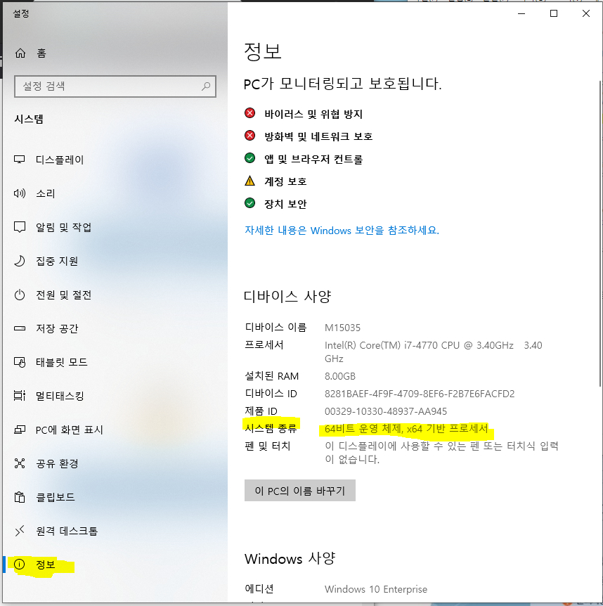
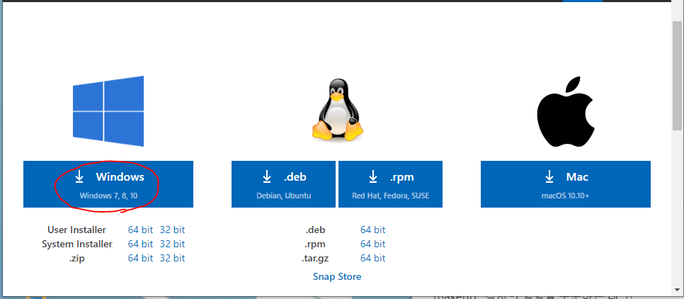
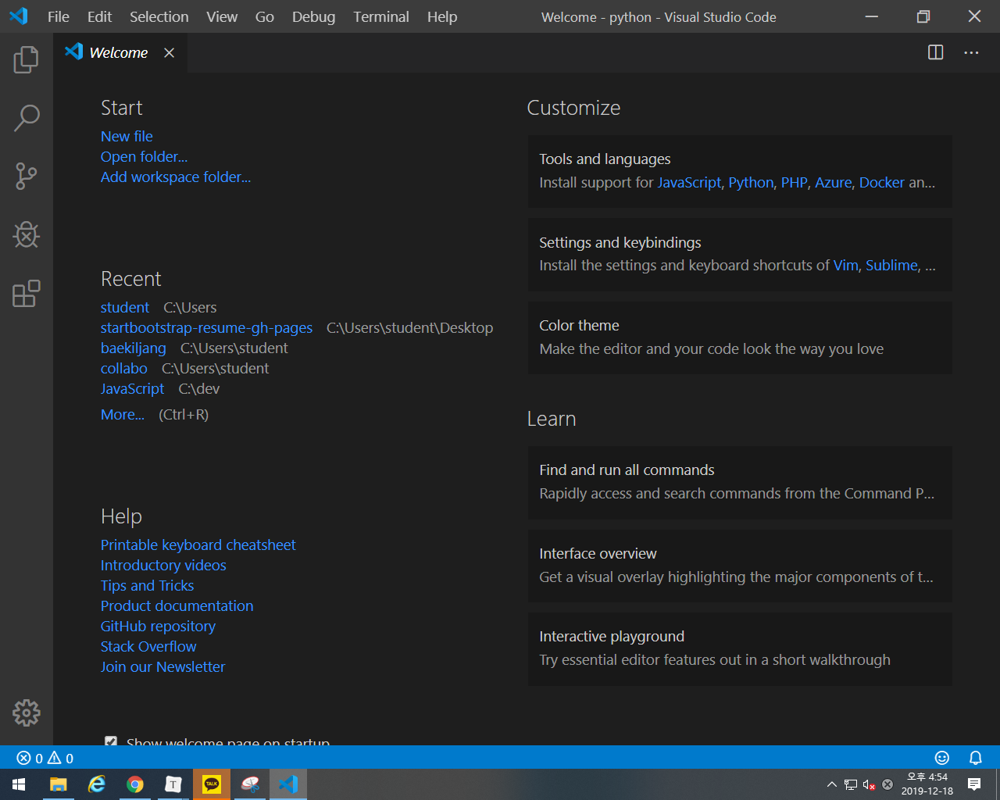
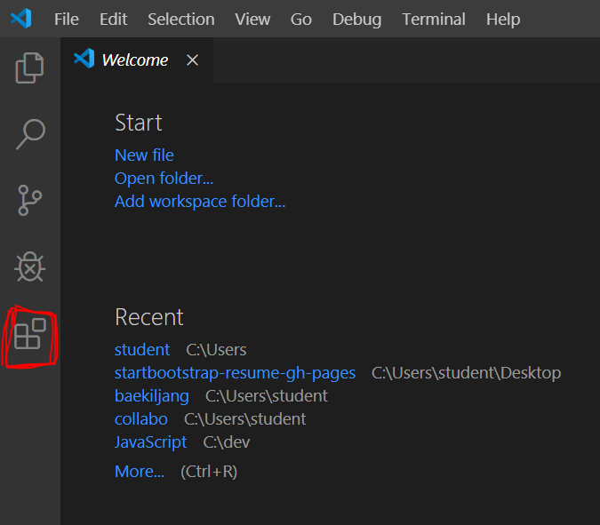
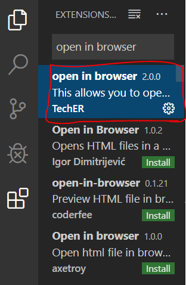
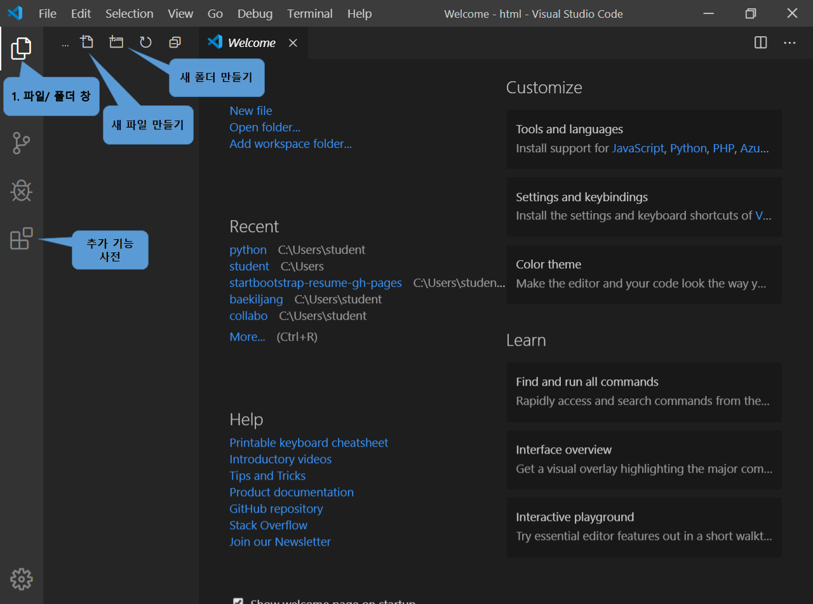
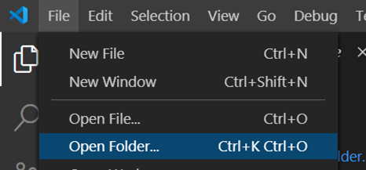
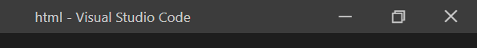

# HTML을 시작해보자!

저번 시간에는 HTML이 도대체 무엇인가를 살펴보았습니다.

그런데 여전히

'그래! HTML이 사이트 만드는 언어라는 건 알겠어. 근데 그래서 그걸 어떻게 쓰라는 건데?

그게 뭐 어떻게 작동하길래 사이트를 만들 수 있다는 거야??'

라는 생각이 드실 수도 있습니다.

우리는 고작 정의만 봤으니 당연합니다. 만일 코딩을 한 번도 안 해보신 분이시라면 더더욱 뜬구름 잡은 소리 같으실 겁니다.

그래서 오늘부터 본격적으로 코딩에 필요한 기본 세팅을 하고 HTML을 시작해 봅시다!

우선 앞으로 우리가 같이 공부할 순서를 한 번 집어보고 HTML에 대해 이야기해봅시다!

------

### - HTML과 함께 웹 디자인에 사용되는 아이들

HTML이 웹 사이트를 만드는 기본 언어라는 건 이미 앞에서 봤습니다.

그런데 안타깝게도 이것 하나만 가지고는 할 수 있는 게 많이 없습니다.

HTML만으로는 꾸미기 기능이 부족해 디자인이 투박한 웹사이트 밖에 만들 수가 없고요,

유튜브의 영상을 가져온다거나 다른 사이트의 글을 퍼오는 거와 같은 다른 서버에서 데이터를 가져오는 일도

어렵습니다. 그렇기에 사람들은 이런 점을 보완하는 또 다른 도구들을 사용하기 시작했는데 이것이 바로

CSS와 JavaScript라는 언어입니다.

CSS는 사이트의 디자인을 더 예쁘게 만들어주고

JavaScript는 서버와 연결이 필요한 일을 할 수 있도록 만들어주지요!

여기서 서버란, 내 컴퓨터가 아닌 다른 장소라고 생각하시면 편합니다.

유튜브의 영상이 내 컴퓨터에 있는 게 아닌데 우리가 볼 수 있는 것도 다른 장소인 서버에서 영상을 가져온 것이지요.

이렇게 되면 이제 여러분은

"헐.. 3가지나 배워야 해?? 코딩 어렵다는데!" 생각하실 수도 있지만

그렇게 겁먹으실 필요 없습니다!

일단 그만큼 방대하지 않고요, 당연히 한번 제 포스팅을 본다고 기억할 수 없습니다.

공부하시면서 계속 만들어보고 그때그때마다 찾아서 대입해보면서 익숙해지시는 거지요.

코딩은 암기가 아니라 검색입니다!

다시 정리하자면 우리는 HTML을 본 다음, 디자인 요소인 CSS와 더 풍성한 기능을 만들 수 있게 해주는 JavaScript를 보게 될 것이고 그러면 여러분은 근사한 나만의 사이트를 만드실 수 있는 겁니다!

바로 시작해봅시다!

------

### 1. 프로그래밍을 할 기본 프로그램을 깔아보자!

코딩은 프로그래밍 언어를 가지고 코드를 짜는 행위를 말합니다.

그리고 코딩을 할 때는 편의를 위해 개발툴을 깔게 됩니다.

코딩과 개발툴이 무엇이고 왜 필요한지는 19일에 올라가는 포스팅에서 자세히 설명되어 있으니 참조해 주세요!

그럼 바로 HTML을 쓸 때 도움을 주는 "VS code"라는 개발툴을 깔아보겠습니다.

\1. VS code

1. 구글에 "VS code"를 검색합니다.

2. 제일 처음에 나오는 "Visual Studio Code - Code Editing. Redefined"의 "Download Visual Studio Code"를 클릭한다.

   

   

   

3. 내 컴퓨터에 맞는 버전을 눌러서 다운로드한다.

   - 내 컴퓨터 설정 아는 방법 (아래 이미지는 window 10의 경우 화면입니다.)

     1. 바탕화면에 마우스 우측 클릭

     2. 디스플레이스 설정

     3. '정보' 탭

     4. '디바이스 사양'에서 몇 bit인지 확인

        

        

        저는 window 64 bit이기에 이걸 다운로드합니다.

4. 전부 next를 눌러서 다운을 완료한다.

- VS code의 화면

이렇게 하면 코드 작성을 위한 개발툴을 설치했습니다!

그런데 이 VS code를 이대로 사용하면 불편한 부분들이 생깁니다.

그래서 이 불편함을 미리 해소해두고 가기 위해서 추가 기능 1 가지를 설치하겠습니다!

\2. 추가 기능 : open in browser

> 이 추가 기능은 써놓은 코드를 인터넷 창에서 실행시켜 화면을 볼 수 있게 하는 기능입니다.

1. 아래 사진에 빨간색으로 표시된 메뉴를 누른다.
   - VS code에 대한 추가 기능을 찾고, 다운로드하는 메뉴이다.

1. 검색창에 "open in browser"을 검색한 다음 제일 위에 뜨는 것을 설치한다. (선택 후 "install" 누르기)

   

2. VS code의 경우 추가 기능을 새로 깔면 껐다가 다시 켜야 한다.

요즘은 Explorer 보다 chrome을 더 많이 쓰기 때문에 우리는 chrome에 실행시켜 볼 겁니다.

그래서 구글에 chrome을 검색해 chrome도 깔아주세요!

이렇게 하시면 HTML 코딩을 할 기본 세팅이 완료되었습니다!

이제 드디어! 여러분은 코딩을 시작하실 수 있습니다!!

그럼 바로 시작해봅시다~

### 2. VS code 사용방법

코딩을 위해 VS code라는 개발툴을 설치했는데

처음 보는 프로그램이라 어색하실 겁니다.

그건 계속 공부하시고 사이트를 만들어보시면 친숙 해지 실수 있으니 걱정 마세요!

- 제일 많이 쓸 버튼 설명
- welcome 창은 꺼주세요!

VS code는 폴더를 열고 그 안에 코드 파일을 넣는 방식으로 사용합니다.

그래서 일단 "html"이라는 폴더를 바탕화면에 만들어주세요.

앞으로 이 "html" 파일에 우리가 쓰는 코드 파일 전부를 넣을 겁니다.

폴더 위치나 이름은 그냥 제가 임의로 정한 것이기에 나중에 여러분이 다른 코딩을 하게 된다면 그땐 여러분이 원하시는 폴더를 만드시면 됩니다.

그런데 여기서 코딩 팁 하나!

코딩을 할 때 폴더면, 파일명 등 이름들은 모두 영어로 적어야 합니다.

한글로 적어도 문제가 없는 경우도 있지만

한글로 적으면 작동하지 않거나 오류가 나는 경우도 존재합니다.

그래서 꼭! 이름은 모두 영어로 적어주세요!

그리고 코딩을 실제로 하게 되면

만들고 끝이 아니라 미래의 내가 계속 그걸 고치면서 봐야 하고,

다른 사람과 협업하면서 다른 사람들이 내 코드를 보게 됩니다.

그렇기 때문에 이름은 이게 어떤 것인지 알아보기 쉬운 영단어로 쓰는 게 좋습니다.

그럼 계속해봅시다.

바탕화면에 "html" 폴더를 만들었다면 VS code에서 그 폴더를 열어야 합니다.

"File" 탭에서 "open Folder"를 선택해서 바탕화면에 만든 "html"을 선택, 여시면 됩니다.

open file 아니고 open ****folder**** 입니다!

open folder를 하시면 아까 첫 화면과 똑같은 화면으로 다시 창이 뜰 겁니다.

일단 welcome은 필요 없는 것이니 매번 지워주시고요.

폴더를 잘 오픈했는지 확인하는 방법은 창 이름이 뜨는 곳을 보면

"[폴더명(여기선 html)]-Visual Studio"라고 이름이 되어있을 겁니다.

html 폴더에 들어와 있다는 것이지요!

이렇게 하면 코딩을 시작할 수 있습니다.

다음 포스팅에서는 이제 진짜로 코딩을 시작해봅시다!

다음 포스팅에서 만나요~