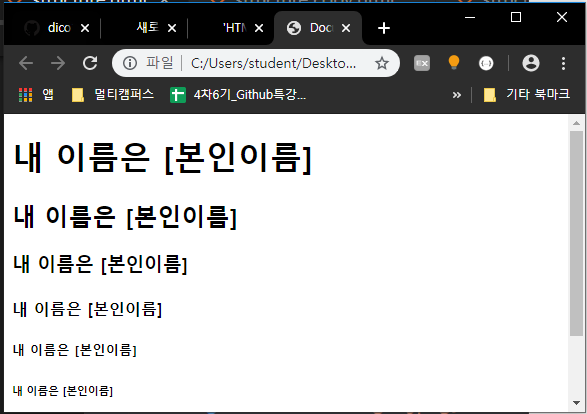
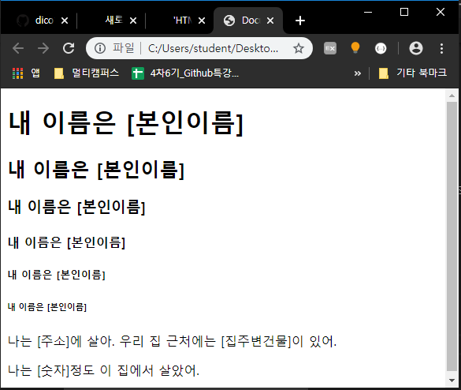
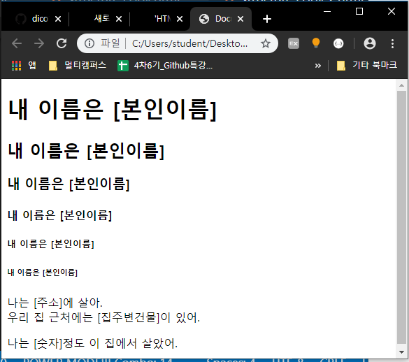
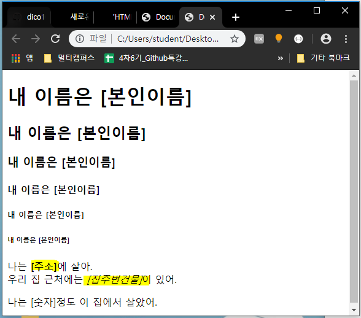
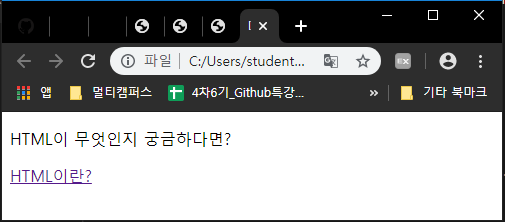
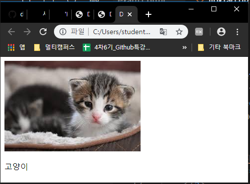
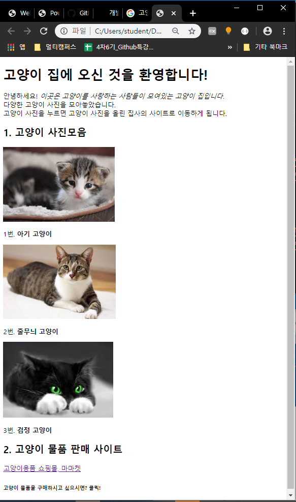

# HTML 코딩하기! ① 처음 만드는 HTML 문서

이전 포스팅에서 개발 환경을 다 구축하고

코드를 보관할 html 폴더까지 만들었습니다.

이번에는 바로 html 문법의 기본 구조를 보고 실제 코딩을 해봅시다!


## 1. Html 기본 구조

저번 포스팅에서 "새 파일" 버튼을 알려드렸지요?

그 버튼을 눌러서 "structure.html" 파일을 만들어주세요.

참고로 VS code에서는 파일의 확장자를 꼭 지정해주어야 합니다.

확장자란 파일 이름을 보면 내가 정한 이름 옆에 `.`하고 붙어있는 것입니다.

이건 이 파일이 어떤 파일인지 알려주는 부분입니다.

우리는 html 파일을 만들 것이기에 반드시 파일명과 `.html`을 쓰셔야 합니다.

structure 파일을 만드시면 welcome 이 있던 부분에 우리가 만든 파일이 뜰 겁니다.

그리고 파일명 아래에 숫자 1 이 나와있지요.

거기가 바로 우리가 코드를 작성할 부분입니다.

1 옆을 클릭해서 마우스 커서를 두고 " ! " 를 입력해보세요.

그러면 입력하신 부분 아래에 네모 박스가 뜰 겁니다.

이 부분은 VS code가 제공하는 편한 기능 중 하나로 자동완성 기능입니다.

타이핑을 하면 자동으로 타이핑 된 글자가 들어간 것들의 리스트를 보여주는 것이지요.

만일 이 부분이 클릭이나 다른 것을 쳐서 없어졌다면

ctrl + space 를 누르면 됩니다.

계속 이어나가면 느낌표를 쓰고 tab 키를 누르면 아래와 같은 코드가 한 번에 작성될 겁니다.

아래 코드를 읽으실 필요는 없고 그냥  !  + tab을 했더니 나왔다는 것만 알아주세요!

```html
<!DOCTYPE html>
<html lang="en">
<head>
    <meta charset="UTF-8">
    <meta name="viewport" content="width=device-width, initial-scale=1.0">
    <meta http-equiv="X-UA-Compatible" content="ie=edge">
    <title>Document</title>
</head>
<body>
    
</body>
</html>
```


이 구조가 바로 html의 웹 표준 구조입니다. 언제나 이 구조를 먼저 만들고선 코드를 작성하는 것을 추천드립니다.

------

\- 웹 표준이란?

웹 사이트를 만드는 것에 대한 국제 기구에서 정한 표준입니다.

웹 표준은 실제 기능을 만드는 부분과 디자인 부분을 나누어서 코드를 짜도록 만들었습니다.

정확히 말하자면 아래 코드가 정해진 웹 표준 구조입니다.

```html
<!DOCTYPE html>
<html>
<head>

</head>
<body>
    
</body>
</html>
```


`<!DOCTYPE html>`으로 시작하고, head와 body를 가진 구조이지요.

이렇게 만든 이유는 여러 가지가 있지만 가장 큰 이유는 시각적으로 불편하신 분들을 포함한 누구나 인터넷을 쓸 수 있게 하기 위해서입니다.

보통 눈이 안 좋으신 분들은 인터넷 창을 말로 읽어주는 프로그램을 사용하십니다.

그리고 이 프로그램이 바로 저렇게 되어있는 구조만 읽을 수 있게 되어있습니다.

그분들을 위해 국제적으로 표준 구조를 정하고, 이 구조를 읽을 수 있는 프로그램을 만든 것이지요.

그래서 큰 기업이나 관공서에서는 저 구조를 반드시 지켜야 합니다.

그렇기 때문에 우리도 항상 저 구조를 만들고 코딩을 하겠습니다.

------

<!DOCTYPE html> <html> <head> </head> <body> </body> </html>

`<!DOCTYPE html>` : html 버전 5로 만들어진 파일이라는 의미. 중요하지 않음

`head` : 웹 브라우저에는 나타나지 않지만 필요한 정보들

ex. 웹 브라우저에서 사용할 외부 파일들의 링크

`body` : 웹 브라우저에 실제로 나타날 내용들

이것 또한 한 번 읽어 보고 넘어가면 됩니다.

지금 뭔지 모르셔도 html을 써보시면 자연히 알게 되실 겁니다.

## 2. 태그

위 구조를 보면 바로 눈에 보이는 특징이 있습니다.

바로 `<body>`, `<html>`, `<html>` 로 시작하고 같은 모양에 /가 추가된 `</body>`, `</html>`, `</html>` 로 끝나는 것입니다.

이 예시들처럼 `<`로 시작하는 아이들, 정확하게는 `<` 바로 옆에 쓰인 단어를 "태그"라고 하하며, 이 태그들은 꼭 시작이 있으면 같은 모양에 /가 추가된 끝이 있어야 합니다.

마치 (괄호)나 "따옴표"를 쓸 때처럼요.

그럼 바로 태그를 사용해봅시다.

- `<hn>` 태그

  body 부분에 아래 코드를 써봅시다. [ ] 자리에 본인의 이름을 넣어서 완성합니다.

  ([ ] 도 지워주세요.)

  태그는 < > 없이 시작 부분의 내용(h1 등)만 치면 자동완성 박스가 뜹니다.

  이걸 클릭하면 형식에 맞춰서 자동으로 생성됩니다.

  아래 코드를 복사/붙여 넣기 하지 말고 직접 입력해주세요!

  ```html
<body>
  	<h1>내 이름은 [본인이름]</h1>
	<h2>내 이름은 [본인이름]</h2>
  	<h3>내 이름은 [본인이름]</h3>
	<h4>내 이름은 [본인이름]</h4>
  	<h5>내 이름은 [본인이름]</h5>
	<h6>내 이름은 [본인이름]</h6>
  </body>
```
  
코드를 전부 입력했으면 ctrl + s로 저장합니다.
  
html은 변경을 했다면 실행 전 저장이 필수입니다.
  
이제 실행을 해봅시다!
  
실행 방법은
  
코드 쓰는 곳에서 마우스 우클릭 > 아래쪽에 open in default browser 클릭 > 브라우저 선택창이 뜨면 chrome으로 선택
  
이렇게 세팅해두시면 이제 alt + b만 누르면 자동으로 chrome에서 실행됩니다!
  

  
- 실행화면
  
실행해서 보면 아시겠지만 `<hn>` 태그는 일반 텍스트보다 크고 굵은 글씨체로 나오며, n의 숫자가 클수록 더 크게 나타난다.
  
`<h1>`부터 `<h6>`까지 있으며, `<hn>제목</hn>` 의 형식으로 사용된다.
  
형식: `<hn> 제목 </hn>`
  
- `<p>` 태그

  위와 똑같이 아래 코드에 본인의 내용을 넣어 작성하고 저장 후 실행합니다.

  ```html
<!DOCTYPE html>
  <html lang="en">

  <head>
    <meta charset="UTF-8">
      <meta name="viewport" content="width=device-width, initial-scale=1.0">
    <meta http-equiv="X-UA-Compatible" content="ie=edge">
      <title>Document</title>
</head>
  
<body>
      <h1>내 이름은 [본인이름]</h1>
    <h2>내 이름은 [본인이름]</h2>
      <h3>내 이름은 [본인이름]</h3>
    <h4>내 이름은 [본인이름]</h4>
      <h5>내 이름은 [본인이름]</h5>
    <h6>내 이름은 [본인이름]</h6>
      <p>나는 [주소]에 살아. 우리 집 근처에는 [집주변건물]이 있어.</p>
    <p>나는 [숫자]정도 이 집에서 살았어.</p>
  </body>

  </html>
```
  

  
딱 봐도 p 태그는 hn 태그보다 글자 굵기가 얇지요?
  
이처럼 p 태그는 일반 텍스트를 보여주는 태그입니다.
  
형식:` <p> 제목 </p>`
  
- `<br>`태그

  "나는 [주소]에 살아. "와 " 우리 집 근처에는 [집주변건물]이 있어." 사이에 br 태그를 쓰고 저장 & 실행합니다. 이 태그는 특별 케이스로 닫는 태그가 없습니다.

  ```html
<!DOCTYPE html>
  <html lang="en">

  <head>
    <meta charset="UTF-8">
      <meta name="viewport" content="width=device-width, initial-scale=1.0">
    <meta http-equiv="X-UA-Compatible" content="ie=edge">
      <title>Document</title>
</head>
  
<body>
      <h1>내 이름은 [본인이름]</h1>
    <h2>내 이름은 [본인이름]</h2>
      <h3>내 이름은 [본인이름]</h3>
    <h4>내 이름은 [본인이름]</h4>
      <h5>내 이름은 [본인이름]</h5>
    <h6>내 이름은 [본인이름]</h6>
      <p>나는 [주소]에 살아.<br>우리 집 근처에는 [집주변건물]이 있어.</p>
    <p>나는 [숫자]정도 이 집에서 살았어.</p>
  </body>

  </html>
```
  

  
노란색으로 표시한 부분을 이전 화면과 비교해보면, 차이가 느껴지실 겁니다.
  
br 태그는 바로 줄 바꿈 태그입니다.
  
- `<b>`, `<i>` 태그

  기존 코드에서 이 부분을 아래와 같이 바꾸고 저장 & 실행합니다.

   ```html
<p>나는 <b>[주소]</b>에 살아.<br>우리 집 근처에는 <i>[집주변건물]</i>이 있어.</p>
   ```

  

  b 태그는 태그에 감싸진 부분을 두꺼운 글씨(볼드체)로 만듭니다.

  형식 : `<b> 텍스트 </b>`

  i 태그는 감싸진 부분을 기울어진 글씨(이탤릭체)로 만듭니다.

  형식 : `<i> 텍스트 </i>`

- `<a>` 태그

  아래 코드를 치는데 " " 안에 http 주소는 복붙 한다.

  ```html
  <body>
      <p>HTML이 무엇인지 궁금하다면?</p>
      <a href="https://coding-studydiary.tistory.com/2">HTML이란?</a>
  </body>
  ```

  

  실행한 상태에서 HTML이란? 글씨를 누르면 "https://coding-studydiary.tistory.com/2" 주소로 이동하게 된다.

  a 태그는 이처럼 a 태그에 감싸진 부분을 누르면 href=" "의 " " 안에 들어있는 링크 주소로 이동하게 하는 하이퍼링크 태그이다.

  형식 : `<a href=“링크할 주소＂> 텍스트 또는 이미지 </a>`

- `` 태그

  img 태그는 이미지 태그로 이미지를 가져와 화면에 출력해주는 태그이다.

  그런데 코딩할 때, 이미지는 워드에서 이미지 삽입하는 것과 다르게 사진 자체가 아닌 사진의 주소를 써야 한다.

  - 이미지 주소 가져오기

  1. 구글에서 마음에 드는 사진 하나를 찾는다.
  2. 사진 위에서 마우스 오른쪽 클릭 > "이미지 주소 복사" 선택
  3. 복사한 주소를 img 태그의 "사진 주소" 자리에 [ ]를 지우고 붙여 넣는다.

  ```html
<body> 
      사진</p>
</body>
  ```

  

  

  그러면 선택한 사진이 내가 만든 창에 뜨는 것을 볼 수 있다.

  이런 방식으로 코딩할 때 이미지나 동영상 등 텍스트가 아닌 멀티미디어 데이터를 사용할 때에는 그 데이터의 주소를 가져와서 붙여 넣는 방식으로 사용한다.

  이런 방식으로 사용해야지만 내 컴퓨터에 사진이나 영상이 저장되어있지 않은 상태에도 그 자료를 사용할 수 있다.

- ``와 `<a>` 태그를 이용한 사진 링크 만들기

img 태그로 사진을 넣고, a 태그로 링크를 만들어서 클릭하면 다른 사이트로 이동하도록 만든다고 했었지요?

그러면 이미지를 눌렀을 때 다른 사이트로 이동할 수는 없을까요?

당연히 있습니다! 두 태그를 같이 쓰면 가능합니다!

```html
<body> 
    <a href="[이동할 사이트 주소]"> 
         
    </a> 
    <p>고양이</p> 
</body>
```

a 태그 안에 img 태그를 넣어주는 방식으로 쓰면 됩니다!

실행화면은 이전 img 태그와 같지만 사진을 누르면 a 태그에 쓴 주소로 이동하게 됩니다. 이런 방식으로 사진 하이퍼링크도 만들 수 있습니다.

------

지금까지 html의 기본 구조와 기본 태그를 배워보았습니다.

html은 markup 언어라는 말 기억나시나요?

이 태그가 이때 말하는 mark 중 하나입니다.

바로 쓰여있는 내용의 종류, 성격을 나타내 주는 표시이지요.

그럼 이번엔 배운 내용을 토대로 문제를 풀어보면서 코딩을 익혀봅시다!

우리는 다음 포스팅에서 만나요~

------

- 모든 태그 활용 예제

  - 문제 : 내 관심사에 관련된 사이트를 만들어보자!

    - 기능

      1. 사이트 제목
      2. 사이트에 대한 간략한 설명
      3. 사진모음전 : 사진과 사진에 대한 한 줄 설명, 사진을 누르면 사진을 퍼온 사이트로 이동 (3개 이상 만들어보기)
      4. 쇼핑몰 링크 : 관련 쇼핑몰로 이동하는 텍스트 링크
      5. 쇼핑몰 밑에 작은 글씨로 쇼핑몰 관련 문장이나 마무리 문장 쓰기

    - 예시

      코드를 그대로 가져가서 실행한 다음 글자 크기와 굵기까지 완벽히 똑같은 디자인을 가진 사이트를 만들어보자! (코드에 마우스 클릭한 다음 ctrl + a 하면 전체 선택됩니다.)

      사진과 사이트의 주제는 본인의 관심사로 해주세요!

      사진을 눌렀을 때 나오는 사이트는 해당 사진이 올라와있던 사이트입니다.

      ```html
  <!DOCTYPE html>
      <html lang="en">
      <head>
          <meta charset="UTF-8">
      <meta name="viewport" content="width=device-width, initial-scale=1.0">
          <meta http-equiv="X-UA-Compatible" content="ie=edge">
      <title>Document</title>
      </head>
  <body>
          <h1>고양이 집에 오신 것을 환영합니다!</h1>
      <p>안녕하세요! <i>이곳은 고양이를 사랑하는 사람들이 모여있는 고양이 집입니다.</i><br>다양한 고양이 사진을 모아놓았습니다.<br>고양이 사진을 누르면 고양이 사진을 올린 집사의 사이트로 이동하게 됩니다.</p>
          
      <h2>1. 고양이 사진모음</h2>
          <a href="https://mypetlife.co.kr/47410/">
          <img src="data:image/jpeg;base64,/9j/4AAQSkZJRgABAQAAAQABAAD/2wCEAAkGBxITEhUTEhMVFRUVFxUWFhYXFxUVFhUVFRUWFxUVFRUYHSggGBolGxUVITEhJSkrLi4uFx8zODMtNygtLisBCgoKDg0OFxAQGCsdHR0tLS0tLS0tLSstLS0tLS0tLS0tLS0tLS0tLS0tLS0tLS0tLS0rLS0rLSstLS0tLS0tLf/AABEIALcBEwMBIgACEQEDEQH/xAAcAAABBQEBAQAAAAAAAAAAAAAFAQIDBAYABwj/xAA+EAABAwIEAwUHAwIEBgMAAAABAAIRAyEEBTFBElFxBmGBkfATIjKhscHRI0JSFOEHFRbxM3KCkqKyNFOT/8QAGQEBAQEBAQEAAAAAAAAAAAAAAAECAwQF/8QAIhEBAQACAQQDAAMAAAAAAAAAAAECERITITFRA0FhIiMy/9oADAMBAAIRAxEAPwDzpmDedlI3L38lvsNlbQNFOcAzksad+Tzl2BeNkjaDuS9GOWNOyhfkYOyaJmw4bZVK7luq/Z6dkIxPZp0qaa5xlgpGBaJnZo8lx7NuTRzgE0peJFsRkZaN1UZldQ7JpecVJTmqy/L3t2UfsHclGtwtNSh6gbSdyV2hlj3bJo3EBqJPaK1VyqoNlEMvfyTRyiAvTS5TVcG8bFQmi7kUNw0lLxJG0XHZWWZdU5Iu4gCcGqx/RPGoKcKPchtA1iWFM5ijeFFROK5oTg1ONNUOaUvtFEQkhQSl6je5MTHFUNcmQnEpriiGpQUwlcERJK5Nhcg9J9umCsSVTMq7hKS04L+GCI0QFUpQrDU2i2GAqN+FadkjXKZr02K/9IOSb/RjkrrApOEJsCK2Wg7JKeTt5IvCe0IM7iMkB2Vc9nxyWtDQmuaEGTbkDZ0RLDZY0bIsaaaBCCi/K2nZRtyZvJF2lSNCDP1MkadlWqdn2xotUWpvCgymH7OtnRGKeRtjRFA0BO9qEASvkbTshrsiadtPULR4jFhokmyzOYZ6GPMXs0jv1/CptVxmRtBHIqjUyNvFHq67Me1GpHMuHcOG481Ww2aPeQ87e8f+n3o+iaOSWpkQE93r8qQZECq2LzVxpi++nn/dNwmcPBaTf8aBNHOrzuzFpTP9NWWgwWd06kaW166R5og3GMMEaHTvKml51ha/Zwjmh1XI3r1Y4drh4KrUy4ck0vKvKquUvGyiOVVOS9TflTeSVuUN5JpedeSPy2oNkgwNT+JXrLslbyT25E3kmjnXkwy+p/Erl67/AJG3kFyahzoFVpwmU68K7j6EIG98FKxByjWV9j1nKFdFcPWsoohxKWm5DjXClZigN0BWmUrqiGf5k0bqpis4aN0QbFZSsqBZVuct5qVmdDmqNT7ULuNZxubg7qzRzIHdAcBUdQKuzFBO9uCgT2kKzQfKHvenU6qCbNs2ZQgOBc53wsbdzo5BU6WcV3xw4Rwn+dWk0/8AbJKrZjiQ2Xm5FgTsN46oO3Pw48Ic0xoHadJVqRqhi65H/wAe/IVKduswg+ZYjFTAw1QcnAtdHUA3CEux2Ia/3S8N3bxcYHPhLgTHddaHB1ahbDnGIkGxjuPNTvF8snjcfiWf8enUawiSYsJ3naEJrYieN24ktJ3AAP0K22cYmxDncWzhuBzHPdZTOaTbwB8IgDTYHTuCky2XHTNV3cVWG6nvtPP5oxjHFrGsAggGw6e9J6geaz+EpfrNibmPEX8ijuZPiuwTBc108jAg+PMdea0yj4uJwbGtge4kgn5Hx6p2GZ7jqhImIjkNB8vl1S4YNDmlzjdzS2eVy4d8QPElVnP4aT2nX2hIk/xcGj6k+CC5lbw7iibAn5/ldhc6c2pBM8IgDvJS+0bh8PBEOc066jaShGVYeRx6mYaOemnS/wAk2PV+z2aB8Sdp9eYWlLQQvKsmxxZUgm+h8p+48l6Dgc3Y8ASLaoogaa7gTvbBKoqJyRr0lcqux10VeBXKIPXIBWNoyFkMypw5bSo5ZnN6W6VmKFBylq5iGhCcXig0arP43MSd0kW1ocTnsbofX7QnYrOVKxKhc5aZ2OPz5/NVqubPO6FcS4ICTMzcN1Ic2dzQopkoNDQzl3NXsLnpB1WTDk5r0HolDtBO6MYTNgRqvKqeJIV/DZq4bqaHqDccDurdOqvOMHnRm5Wky/Nwd1LGttHmdEPoPvJFwvLsbgHPfwt1leuZbQLqbyWnhLbE6LBYrBuY9xBab6Hl9kpFjs5l5pNJqnbS1uXumRIVmvnPBDWkez/aRYg/j6IDicc48hFtdFVa90wTrpe3lzWMq3jBjE44n3ry37H6oTmGNPC4tvAI6XlSm4AOmgO4k3B5i/rRDsVW4QWuBJsI3jbr/dYjWUU+zFUurDSRf7A/IeijecYYEnXjEvbzDtDHW3kguQVBTrtDhHE6B1MQe6LeZRrGiaribGx6Q7TzP/j3ru4rAoh1Nrogsa59ty1zi4f9zXFAiwvrUmtFg6//AOhknq4rY16bRSYQIBDwRf8AdPEY6tf5qDAYJjfaPMCHTP8Ay3t4gFKQB7UYf9Sm4m0we8WJRHAZfw0h/K8d0kDXlqhb8xFeqWGfdLw3uvco7Qc4NaDAhoB6205rGV03jNrmGy6k9w4/eLRoO+0yPXkjtLA0BH6JG1ib9eeyzGHxXC6dnSANSY5+IWyyzMA9hBAkSI1FrT3iZ8ljG92sseyo3E4UPgPqB429pz0HCefSbIlSzEQf1BPIgO8PdiOqwmZHgc8zYkiRH15qXL80aYHGQRoZ2GxHJdLtzkbahmQc403CHxIGzhzaeSeTdA2Hi9nVAHEyo3u91xhwmTIutA8Eps+yCquUfCuTaq9atZZbP8yABurOZ5hA1WBzfGF5K2whx2PLih7nFKApOBEQBcQpS1NLUEMpWuTXtUlKlKDiUxGMJk73bKLMsAaeoQDlwKZxLpRTiU4FMShET06kK7hscWnVDAVZoCSivVex+ctfScwvExYbeUIPmZ950c+TSD8knZ0iGw1uwkgTHMFSdo6fs6kNdM8jCmculw8hlFrifhEcuAH7JXUnifhjYEUwR3idVNTw5iXIHiMYTUDWiBMToPwuE3Xe6i9VxLDZ3CLzxB0X3sbX5AKhnlI02C8tNw7dhmbg/tNp2vzME+zK6ZIdHFbf4fPWfV1L2pwQOFaWj4YkCSQDYxPd/eVuSMZWs/jcEXU2V2iHNA6GACCPW6N08Ga7adQWJNEu8hbxIHmi/Z7AtqYZrTo5uvc5tpHUBaPJcj90Aj3Q9ju+Q3/ZaxYy8hOLy88I5Q6/INLiD3/EFisyxtWsfZ0QQ3iLCeZZAPynyXsuY5aHUyALwY8tvEBZvD5O3D4ZxLQHe8T/AMzpLvn9ArldRMZuvL8myw06zuLa58dfXctPTp2MiJ8YGwHf0VHIcA97nPfMSSdzPMlFKeNYH8IIta0TPcuWcu3bDWjK2D4QItoJ8LXT213MEgkTIAEXHeQilSgXt5jzlVsxw5HwgadNNgs41coFZ2HPpTAawCGgamBqs7l+FeXWF1tfip8MmdIGwA79OqjyLs6eLiJtN7z811tYg12YwBDAXW0Mco9StJwKDC0w1qsByMoTTXKQlIqPI86xOqzzgrGY4qSqvDIXRzREiUoTGsurDqJAUCCnZLSpypsI2bLmjhfCCNuALjZGstykN1C7C1WhEqGMaVm1qRfoPY2yAdqqjS0wreKN7IDn1SyqM4SnNcmJQqidqcFCHJ4cilKtYapGkHuI+irNKkYYRG3yPEgizxI1EW8QUnaF3EQ4xxDyQXIswPEA7h7p4R9pWqx2FZXZs1w0LRfzIWr3gxWJzSsSG3bNgRcFE8p7HvquBfUN4JAufE7KljaTqTtb89JRPJO1BpEA6Aiwgedlyvbw3O/lTz3G18PXdQa7hY0WkDSNifRUWF7T4gNcXcD2NgOafddDjENixIWs7SZdSzBgq0XBtW3ECRceuawmOyStRB4223OxnRamqneV6dkVYFtJ1P4XQR3TBXpOEaOELy7sBT4sPS34ft6C9TwbfdHRTFck3DYrJ9pC91IsYDLrA8unPRaytZpXkH+JHaOoan9PRcWNAPtHtsS7+AdtreOYVs2kuhfC5SKVDgBcSficDe+t/NVcL2fpsJe0Gef7p+3gsRkOLaPaO9rWFSC1pa8ECC0Ava6eIGHbLbZZXxdbCve3hqOYWgRLSQ4XvMSPsplh2WZ9xLB1JaRqZPgVNUpjhuJ8IWMy7tU6i/gr0y0zJGkX81pnZ/Rqsljp7tx1XnywyjvjlK4YUw6IA7hdEssHs6dzrtKBYLFF+miuNkuBcfh0XTHdcqN+3T6ddUQ9Oa+FpBHjXKoK4XIPCqoJS0a8WKu1aHBZDsWzcLpthdptui4w4c2yzmFxOxWmyR/FZECILHwo8e+HAo7m+XGeIBAK9Bzj0RVhr5CnoyFUwgvCJ0WXUBDDmRdAO0K0NNsBAs4ZxKRazjQncKtMwp5KduCK0ypUqSe/DlFsPgVM/D2RWdghSAoi/AyUgwSIr4X4hGvX7rdZBiqjoY6/KSwx5CVmMFghO3jP4Xp/Y7KRwhxaPJbxm0t0zOcZI5k8UFrriZi/jIQfC5cS+HQL6yDbutovZMbgWOaWuAWVqZSxrodBG1pWcsdVcbt2UZbTiC28ajceA+qTtBkRrBtO/ACCSIn5oxl+EDfh07laxFuvesSab3tX7P5cyiwMbFtTzWqwRPdCxOExv6hAO+/PktPgsUZSV1vxXQtjGE03RrBXjlbs1WxDakyH06jiQZFyfiE2iw9BexYaqXG2ilxGEabxB+vVacb27V4XlX+HNXiJc9jBpJN4PIALajMcNg6Iw9MzHxG0nmSpu0mWNAJAI8Xx5CfovOsbgJdH6hjaeMfXRY3avaHdo8YzEOimGnvO3johmF9pTPC42NoEQPElX6eCINoaeUAu+iu08l9o4Okg7kDhnuhWT6S3uvdnqro1mO4fVE6szopMJgmUhYdfW6nKCKnUITqlayR7Qq9VZaL/AFa5UXMK5B59mGL4jZUiZSKWkFthTLIK1vZWkS4ITUwPELLQdjgWuhwVRunZQHs02QTE9m4BMLa4CoCFPiKAIQeN/wCWljzOittYAivasBjrLPh5IlAr694SNoBxuqL6vvXT6dci6C6zDNCWrTaAh9LF3N0zEYnvRRXD1mmyV1IOKo5WJlSNrFrkQ+thi1QMqtB+CepP2hFWu4wqdXDQ5UXMrqEuAawDzP8A7Er0/LJDBxarE9n8FBDnW66+A9BbRuKgQAOvrRbx7Rmp31L8uv4VXFUw66aao315bnry6ap/HaT4d3QLFqo6TgBFx0+qZiMT3+Yn/Zc876fX/f6Ktibi3SOSzXTGgmZs/U9qx1xHEB+4Du6ItkuNdVADSdb9yFYjC1DpH1UWXNqUSJnqPuFy13fQx+ScNfb1LLnBjYmXG5n7IiypPJY/LM0LgJPr1KLtzFo1hdo+dn5NzzDhwImPBedY/KDxktqv6SCPlC1+YYt1R3u2CqsogGXC6Msph8rre0Dr6jU274MSOi0jsO1rZAg7q5VeIsQgmOzIi3EEEmIrQO9Q+1VU4oES4qWhXaUsWVNMpgU9Js6JaVKXjlv09fVYbc3AOIkNN+5KtRSxTAAA2I2C5a0zuvnUiymwbhK2+N/wxxLTFN7HA7nUIPX7LV8K6azLfzHwq6Z2oDGBtirWFzRrXAhV8dh2O0UWHycuQen5DmHE0GUcq4wcKw+SsNJkHZSYnMyfdCLoN7W4oOcgtCuIRPMcprPJhjiYnTZY/F1XMcRoqi9m5AMhUaeLtCVzKjg0Frve+Gxv0VUYSoSQGOMa2KglNS66pWSUMI98hjS4jYAk+QTHYOqLmm8AaktdA8YQXMvzDgTsRjJdKEVLKRjrINz2frBzblXcVRAcC1zW98yfCNPBZHJ8aADJhHsHVpPvxu8lYDlH9NvEXuPQa+J/CsUu0A+Fog9ZI8efeqtSmSyzp62QrDYdwcSRxDnoCdmjn3nbvVRssLiBHG422G7j+FYp4jiM+Q7/AMLL0mPJlzvDYDkByRugHAX9erhZaXnPn1r3lQvNykDlz1FhRWCc+qIuo2slTihKi7R0asfCLyrLHE67adOX0SNoRBU7IGqsZtWcO3+x38VJXiLobXxBYbKIYp9T3Q1xn1KqKuauj1BHisjja4Djcoj2hrV6Y99sCYE/TvQrK8O7EPuLD4jy8EElOuTHEekIrhMM914MC8Qi2BySnT4SGE3s5340hEK/u6kfRTk1MS5LghYuMREfgqTGU2UgSTEkx3oZWzLhkMQbG4681Hme89ea535PTtj8X3RN2aumwt1C5ZR/aFoMAkjmBI81yz/Nv+t7FUqWsVBmWEbiKTqTrhwTG1AJ4hEqKlj6bbOtC9DyPN8R2CxVN/u++0m3cO9afAdknta2XNncclrmYprhIPhul4RvqdAr2ASnkFPhIqPv3Wsp8PkeDZfgDupkyrgIdeIDbX0KFvYQ4tHVu8rI0dGnTcLNgRCHV+y2ELmuNJhLTIMD5qLA40tgEc56q9Rxs6hXZpY/oKcAcDIFhYWHcq9bKaPCR7NsEybRJUgx2yn/AKkR9k2aDsuyShS43U6Qbx/FZW3ta8FjmN4SIIIEQrrBI7kxxa0xGu5QefY//B+jULnU6rqcuBaIDgBuIOq857ddmW4Kv7NheWkcV22HMB24X0TxA6OVfMMLh6gisGv294A2KI+W8M+DCO5WHhwLSvbcb2Oy+rw/ptaGz8MCepGoTML2NwLRwtYepJlNDz/21ThHHHT1soqNccUE6bDTvXon+h8MZILoiILtDzCEN/w2PH/xzwdzfe8TKVYHYVzIsJKtgk+u8/larL+y1CkwNLQ4jVxJkp9TJKAdvOwBsoM0xqeWrQMyNsyTbknVMtpgWEnqml2AtbAVqgyQrbcKN2gDz35JzHtbbVTwukJw7uVuajOXucIJEbEaqevmbW2JEDvBuqVTOqbRbiP0U5xqfHfS7Tw7RtPVO42gWgLP1885W8fUKjiM2J/d5LF+SOk+Gj+OpUnj9TgIF4dzQuiMNSJNNkE6wLWQGvmjdSfNDMVnzRZpLjOguVnnlfEa6eM81sK+budp7seaE4rHjV7jJm86LKVMzqOJDRHeb6coUNNjnXe6bnXQRoYV4W+TnjP8wUx2fBpIZ7xtyieqD4ms+pd58BYd3VJ7MSpHsW5jI55Z3LyWnSsuVpjRAXLTL1o1aZsxzeE+J8k/2lOIBbG4IgHyF15KO0zv5HzTx2kd/M+azz/Gul+vWDjaTPh4b8gfwh9TO+EzBJ6GIXnTe0Tv5nzTXdoD/JTqX0vSnt6Q/PqbxdjgeQFiuGdMGjCPsvNRn3MynNzwA6qc8l6WL0g5oDtb1qrmFxIMLzFuex+5SMz8/wAj5qc76Xpz29Er49rXXKnp5tSEHit5/JedN7QH+Vu9SDtAdiJ6BXqJ0v16hRzyk5vEDpbvHgpsPmVN3KPWq8l/zsnV5841UtLO2jUz1Tq/h0f16s6s14uQJ0gHw3Suw7g3/wCyNjET0XnmH7WQI936dNPWin/1cT/u77Fa6kZvw1uXOMAe6LeS6lwwA1wkG55rDHtI3doP/UfuVH/qHh2HmVOpDo16XSqu5CPXJPqutqG9CF5ie05Gn1d+U09qHC4Inz+qvVh0a9Efi6bTHHfzVQ5hSJPveMfdee1+0RN+IDwgfJUcRnx1LjPWfWiz1PxZ8PuvQsTn4aYBEbbnqhuI7RjUT3f3Xn9fPWtuXD5fIKlWz0xLZPKBcxobqcsq1McI3WIz195MdPmh2Izkzdx6T6vZYx+Y1nWENnmosNhatTdxPIC5U4X7a6mM8RqcRnTR+4Dx+SoVc8BMCTbbl6lDqVCmwHd53IkMI0udTzO1t9FoMAknU6m+vM6lWYRm/LT6mcVXOhjDA/kY5qJr6r3HifwgW93u3706iNT6Kko2BK3xjFzyv2pDCSQXOLhtJkW5clPQpgaKSk/Xccuqd7K3umRHiB3hNpo1o1XOENtumsK6qqhabd07glOYFYpta2TUadPdGkzuT/FLSQwMJ0BI6ErlEcxqNsHuAGgBIA8AkU/kvZmnYW65uEHMhcuWqzo72FrE+f1Tn4O2p80q5AjsHG580/8AoBEyVy5An9Af5HzSvwLh+4+a5cg7+lqAfH+fBQvZVH7kq5SRd01zqo/d9EpqVRAlIuV1E3fa0x9dgn3ROh1d4Xgaa6jZMNeuNxKRcpJKttn2mbicRzCca+IkAuAnqkXJxhyvsoq15jjSkVnO4eON7Llyahu+04w7iQ1z3E/Yc/mqzsIC50kkbSTYrlyQq9SwzTq0HT6ifv5p1aAR022vt4rlyofSbNudrqX2gktpkhp4QSYkxfbQEwYvoOS5cs/a/SCtyTnO0Hl+Fy5aQ6mQuLrfJKuQRF0adyfSfC5coHbTF7z+QmNSLki1cYGhvEdTcDaBu78KOpUJuTJSLlIVTJSrly0j/9k=">
          </a>
      <p>1번. <b>아기 고양이</b></p>
      
      <a href="https://www.hankookilbo.com/News/Read/201904291390027161">
              <img src="data:image/jpeg;base64,/9j/4AAQSkZJRgABAQAAAQABAAD/2wCEAAkGBxITEhUSEhIWFRUVFRUXFxUVGBUVFRYWFRUWFhUVFRUYHSggGBolGxUVITEhJSkrLi4uFx8zODMtNygtLisBCgoKDg0OFxAQFy0fHR0rLSstKy0tLS0tLS0tLS0tLS0tLS0rLS0tLS0tLSstLS0tLS0tLS0tLS0tLTctLSstN//AABEIALYBFQMBIgACEQEDEQH/xAAcAAAABwEBAAAAAAAAAAAAAAAAAQIDBAUGBwj/xAA5EAABAwIEBAQDBwMFAQEAAAABAAIRAyEEBRIxBkFRYRMicZEygaEHFCNCUrHwwdHxM0NikuFTFf/EABkBAAMBAQEAAAAAAAAAAAAAAAABAgMEBf/EACMRAQEAAgMBAAIBBQAAAAAAAAABAhESITEDE0FRBBQiMnH/2gAMAwEAAhEDEQA/ANAAjCARgLm06BowgAjhGgMI0AjCNAYRoI4T0ACNFCNGgCMIkaWgCAKCCNQDQQCNTYaqxeJcXljDEW+f8lNDMH0zFUEtt5gNio9eroxLp2JB97q9OHbUZeIP85LKY27sa3Uk2DSCARcHZAsCoMJXdhn6Kn+m42cdmnlfotCDK0nbOzRBpojTTiJVpJk0kk0lIRI4jaMaSQaSlqjxeZOqEsojyD4qo5xuGH+vspsOdn61ZjbFwB6IMLXbGVC+4tDflzJPzkpOSVPxS2baT/dFx0rSc6km3UlZuphNmklxLardSSCwqzdQTTqCXEbVxBSSSp7qKadRKOJ7Q9ZQUg0kEcRtb60trlWtxYTzMQFpMi4p4KUFDbWCcFVVyLSUEajiolionstHgEcJsVEoVEAuEIRB6OUECNBBGgJBHCOEASNCEEjZviGjFUO/U39rfz1UzhzHOIh0AC0u/oJ2SOKCIp3h5J0jrtMd9vqqrLT+J5wA4bc5jt1/kc1lj1lXTrlhFrxA0Pa7SZm0xA9BG6p+HuItM0qpszZ99p2M9P6HohnGZF79IHlbaG+b1JO2/IdFncyyqqwk9ZMTtMTI9vqnubZWdOk/f6X/ANG7TuExVzrDj/cB9Lx6wuU1qxoAOLSfOw3NtMSR2n06dVNdii82EfpMRZ3mvtNiB8itpjGNydLpZtQdYVWz0Jj91IfWaBJIj1XJauZlkMcwBxc4OcJ1NYIAmORhKpVKsmCXAmIkxAGwHcAe6WU0eN22GOzo4ioaFGfDBh7xILuwIBLR8locDSDGeUExbSHAg9yNpXLstL6NX8Zpg3A2kG3TsFsq2IZ4QdTdBjZxDD6X3/myietNdHMzzOSWxp7EQQhw6z8Vx6N/dZ+k8vdJIgLWcN4bSxzzu8/QJZd2NLNYrUhJKcKQVTEghIKcKQQgjZCSQnCkFLRmyEEZQRoMz4jglsxLkosRBix26dHW40qRTxyh6UtrUbpcYs6eMT7MWqxjU4GJc6OEWrcSliuFUiU3WxYZ8RAVTOpuC9FZLFVYjFcTgfCJVPiuJcQ6zXAei2kyrHKyOoislCquPszzEtP+o75qzwnGVdvxDUq41PKOoCqliosdl3F9J8B3lPdX1LGtcJBB9FFtnqpN+LUPSg5VrcSE4K46pcj4mM+wBq+G5u9JznxzMMdAHz0rntN9V9Xwg65PcFdHxNUljgDfSY9YssBw/l1TxjXfYCdIEhxdcS3oOUGyV92vHOyaaXFV6dBrWUviNibTqNjYCeRuQqDHPc4FziXO+EkQSLu0yNhuAT35q2GBc57g0E6RMkCRJuCZkW/wmcfT0YOufDAewhpJabtgiRvIM79yljE5Vl8yw7q9PythrDqe4yfKAJaepmR6jup2gufYtMNa5uogeUwRI3AEg+u+6tcBlhp4AsfOqqHOcecOsGjra/qpvCnDpqGp4lmsw+k2g6nCBPX83sFrjd9M7NdsLicJUqPbWkeGJGqNLn6XlthznTM91aYejUFwYkgwNw3cCO5AMTsBfcq74swEYQOpw3wQ1xaJuBZwJG1726FM1KcYalUqDSXjkCXkuG0WDW2m/MdgEb3BJorD42nVIZUPmAADx5niBH/Y77e+6qOJ6r6LmsLSGESCXDUR1cB/lG+ncEy0k7Nk3MySDfnyk7+ijZy/8MgnUWHVJmQDyMztP7KJ1Wsp3BVQGkiSQAY+a6LkRccPSLhBLA6BsA64HyBC55wnhPHJpzAcPNyhsjVHeJA7ldRYwAAAQAIA6AbBEnZ55yyQRSSnCEghUzNlJKcISCEyNFJKcISSEA2QgjKCAqvupTT8OQrtjQjfSBXBM67dM8aZRAK7fhwqbHYlrX6d1rjvLqJysg2PSzimjcqor4g3vAVbUxN+vqt58d+sb9otsdncWZcrP4uq95lxJTlZ7jsFArue0wOa1x+cx8Y5fS0QomT0RauQClsaQ06k3haLiSYT2RqoyeyM0xFkDgnF3mtdLrUGs5yU9jSMKPSVMweOq0z5XH0RUmcylUmaj5Wk9yj0tLvB8Sn/AHB8wrXDZ0x+zh81mvuAO6X9zYLwY+qi/PG+NJ9LGxpYgkgdT8kVfENplz4c6S1rWsu4uiQ0N225LO4F7g7S2Y9fndWGTjXiTWF6dMlrW8i4jzG9p2HWyz4aO5b8SMyzPF0qdKnTYKRrPc3U8AvbDdRsCRPLfosqOK8VTq+G57a7dUaSAHWsRYActoWpzjMWV2im86DTf4lOqBPhu2h7bEtIMGORHRVtXLXMJrDCOqOIJ8Rha6nsfMHWt6gJ4612i8t9NHi4q0adZkltSI2tIiL/AMEKdm+ObhsO2k2zn3Itt5uQ6C/eypuEsSHYBlIP8/i1SALkOe46RHqVVcR4p1TFvJs1h0gG2zQ2/spx/wAdrs3T+MxzaWH8Wp8JmGbyDMCDuqOjxZWe8UvAbciNbvN2AizLdlF4nxbHVKFOdTG0rxeHGRP0P1ScjwTNeum19Vw+FoBgHq5xsPmVWOOsd/tOeV3qLw5jRqtaaYcx4dpNN0nS8QDpvFvRV2YtIkwNog38pEbTbv0V7gsHQpUdFYsqPc91R/QPebhnYbSse/FRUdSB8hOpgm0bQCfmiQ9tBwDhQyrUdFtI0zy1G49bLeiusRwq8t1OJ35LSNxgSuXapj0tRXQ8YKs+8hH44RyHFZGoEnUFXir3R+L3T5FpOJCSVD8VDxinstJJCCi/eEaexpMFMqPj8R4bSVbOw7hyWZ4hrS7T05Lh+WG8u3RnnqIlfM5vzVMWEkuJulTMnukGSDZd8kjlt2h1al7nmmqrYKkPDYnmFAq4sGw3V7TYfbWuk4kwJi6epMEC/qFPw2BDzqdOkItEiPlmGJGt+yZx2I5NsOULQV6oA0s9lUtwsOvtv6FRKqo9Co0CDuojcNqdqKsMawA2F+yItDGmd0AxVpD4feLp+lRmA3bsNvVFgKLiQTsf5dWTvLIbM/RAMO0MESSoL8WAenRSq9B5EuHp/hZ3EuJdCrEq3XBOH8aq5xEhrXEkG4ERfqE9VzSjQHhspueXk6gwA8+cLTfY/wAPllB1eoDNTytBEANG5juo3EHDVKlXNR1KWk7gAx7kKfrNSUsLvpmauFfUOoCS4WboLXN6NcTb59IV1h8qrswpos1AVDBgmPMYhsCy0uTZawtEXB/4kfutZhcO1jQ2xjrG6nDHkrLLTLcL8JUsIGlx8zC5wGwk3k/qIHP1XNeOYp1KukWDzf8AYk/zZbD7U6eJZUpV2vd4HlZ5DpNNzjGp362k6ekXXLszZWr1PCp66jnNLnGYaJdEu67FVnx8VhLrltHyQj7xTr6diZHIwN79itBnWdVHEgNDWbANkN5iTHbr0VbUwrqB0aXOdpk6Wk7QDEc55K3yfLHVQS8EcgHW2PQ+ix5T1XHXSkpAuJ1viIsdJBHIg9BeyRmuDLgwsiW3nkeRkq/zThtkQ5jiORbqED5G6z9GhWpk0tUs2AN3RyCqZfuFY03DzIoEuuZ6dU+WK8yPJD4ABtabCNgqeuIJCjPfrT52Xo0JSg4oSgHLNpoPGcEX3oo025qexxhwY5GMeozmJp1NVsuMWIxwRKqNNBPlS4R3Z2GbGy5ZxlS0V3Widl1krB/aVl5LW1WiS039F1ZTpx41gXYc6CO6BAa3fl9UoVpFgVDx7yG9JWa9IrgCCZVNh2+Yn2Vq10Az0UfD0xc8z1TgpWCpvcYCvq2JNJkdlDysEOk9FMrgVLJ0QjK3ajdS8TSiX8uiQ7Sxvl3PLqm8XiHCnBF0gh4BviPLjsDZTcXhtQAMJWX09LNoPZM0ak1Bq2CkzzKAYLWTlPUY5Rcnv0CRWOowLhM4mq5o0gyN/T1QC8ViAZgwVSZdhfFq6AS0k7geYyeX/iax7HxqndW3COX/AI1PXYuc07S6NwXfpB+Z6DmKxibXf8hwgpYenTEw1gF7HZOYukHbiVIotgAdAm6oW2XjKK6hhWsPlEfMx7bJyrXI/kpT1GqrLelKvPqzKlJ9OpBa4EFvWVz/ACfLDhWOY1gOokk7kgmwk9l0ypTY7cBRH4BnOFOc5RrjlJHKauXh9a4aHEXs8zt3jkFs8vwIYwag3/rAJPTchXYwdJplrBPWLpZ09Fl+M7ntjcyy+o90ta5nIOB/ptH8slZTw48OmodQBm4/py+S109EGgKphCudP4amAI5QshmuXuFR09eWy01fFhonoqqrXFTzBL7/AOqvj6zrsKU0aJWg8FJdhAuTm6umec0pCvn4IJl2XhPmFKSkEq3flqbdliqZQlSUSsHZcUFXKB2OU1i6DajS1wkFKJUXG1CASF6DznLuKcpOGqENu11x27LLYypLd1teI8S6qS1/LZYbF04JCyvrWeIlSq20H1TtESRe3VVxEH91YUniRASC6wTA2mT6osukuJ9lI1NDLA7c0rKaYiY90GDMGXVJkAD6lHmAHOI2Tj6+k6RF9+6rcwqnxGoFP4io5rY5KDhahLpAMnkp2LnRMfNJyoEXFwPdIJGHoSZdzlQse06oEyPb0Kl1MTHK8+ygPxGqSXW5xzSM1jKwDd5dyJ2b3A2n9lZcH4kMrNqF1gbSev5iP1E8+3oqWdc3sBB/slUMa1rJ0wdW3Kw5dLK50i9vR+X4gPYHAzI3T1RYv7Ps0c6noduNrzvyW0K29jLxFqKPVUuqFEqrOxUQaoUcqXVChVTChUApshGHoiUjJhNV3WmYTjys/wAQZr4TTDSSeQI/kJhV59m5MtDhba2/ZDg7Emox4LtUGR6FYLM8eXO13aeh/wAq74HxWmvAtrG07newWf1m8K0+d1k6IaSGhIe545FMurOXA6tHnNTbmpo1ykOrOQejhBSCE34pRF5T2NFORJsvKCNjTpjgkOpzuntKBavZeYzWbcNsqSW2K55xBwzXZs0kdQuz6U2+iDuFFxlVMrHmrHYRwOxBT+Fc50CLrvOM4Yw1Uy+kJVRi/s9wxk0wWu5Xt7JcKfJziuNNMAkzzT2XvIZOwvZXme8J4pvwN1gb9Y9Fm8Q91PyltQcjqaQJ7FRZVSxDxVc+KPX0+qsH0pIN55E3VZXdqIVthMUGjzFI0TM8W0ANlNZa4QSLzz2g9knH4fxT0G5KewFHwxMduk90a6H7LrMdzA6gDnPdU2YVTZoMbW7f1VvjcTDDsel9lRs8x2kzv0CchWn6GLEhjWggDzEyAew7qVgcA0gkEkg2AjqmsfhT4Q8ING0n8xKby6rUpECqIBN3G0fz+qf/AAnQOFM4NNw1iI3kki+0uJsfkupYTEhzQey4LRe8kPaO4naPyn126rovB3EGtoYTfrt9FeNRlG5eolZPMqyEzWRSiFVKgVyp9YqtxDlFXDTXJxrlEdUhKFVIzOa49tJhc7ZcpzvM3VXEl1piYAt0Npcrfj3iEavBpmTzI2B6dysc1ogl+08+fME+6egMGm3zGD1O5+h+imYLGvaQ6lTJLSCHQ6xF7SqXEZkyYA2MiPYJAx1Z4hkwOQ/dVxG3pXhLM24qg1z2aagEPb0Kt6mV0ju0Lhn2b5xWoYtlOo86HwHCbAn4dR9135jpCepfU22eKt+RUuiadkFNXKJT+LC/o/yZfyz7+HhyKivyB3KFqUUqL/TfO/pU+2X8sVWyh4MaZQWzIQU/2mP8r/PkfCBRhBdTnECgWpUIEIAg1DSlgI4TI2WpnEYJjxDmgg9QpUIoQGVzLgfC1DIboP8Ax29lmM2+zyqb0ntPYiD7rqJai0qeMOZVwrEZFi6QLX0iGj82490xjQQ0BwMnmevou8PpA7iVCxeS0aghzGn5XU35q5vOmbPIaBN5vb2T+BeKdHVaT7noAt79oPA7W0jUohxINxuIXMWnUWMJgDefqlrobW1PL8RUHiB7RtDRf3Vk7CeJT01B5u30M81UtxlT/TYAZsJmADzN7LTZHg2VKraXj6nxfQHQI6mYRo9oWVZa9huHlvIamCYkxuFrclyhznCGPp3BJM39SLLW5fw5SYBPmd+o7q1p4Jg2T0nZqgNIjokVaicrYQclArUCptOGsViIVNicaOqnYnBNf8QP1VJmGRuEmk4z+kn9lKobrYznOyhY/Nvw3aTeFnM2zB9Mw4FpBuDYqozTORo8pnf5E9UaMxi8u8xqXJv9VQ5rijAH89SrjAZrNnqszrAukvFx1V4zvtNvStw+HDiPULT5RlRMaSBeSYNh/dUGTUi90SAACSStXhKOIxP4eFY7S388RF9526n5J5+6OLnLsH4b2ua5rnBwOmNOxndwuV2fJ8eK1Jrx0uOYPMFcUrcPYyg0OqObVYAJDTBaOZk81qOEM/8ABqNpuB8J5A1T5mO5a2kzc2n0SxLJ1CUSIPQWiByklyEJJCAVKJJ0oICVF0spKMBACEqERRgpkASkkmEAUApGiBQQARFGUJQBQgUJRJAh7QRBAI6Fc+4v+zplZxq4aKdTcj8p+XJdEhAtRoPOGK4YzGg92ui48wWiR6yOS1/2f5b4ZFao/wA8fBEQe668afootTK6TrljZPOFNxVtDpY3upAxKSchpcpHoSidlBHw1SOxAKWqOj7XEonsTbcNVb+l3uP3Sw94+JhHex/ZGgDsKOig1aEclZ0q4Npul6G9pRcdjbJ5hw/SxIirTnvzHzWaxf2T4Z0lr3tJ5SCumhzZ0x/6mKrg0EjlvFz/AOok0e3nDizhSvgX+YSw/C8TB7dioeBxGsaX7RC75xLg6WIoOa6HBzdTT3AkEd1yRuQt3CKIhZJw0a1U0WSGVLueBOhokwT3+S3mPxD8IGUqOkU2gNg/EeVzzU3JMkqtw48Gnre8S6XaQB+UagJ/yoFXLsXSJFTDPAPRxq0jzMh9gPT2WWUuVXLIbqZkyqC6i+XD4mFxLHctP/E+qzNckRWonVLrscSSNJnSHEyYUvGYSmSTodSe6xAsCB3EiQVU+I5niNcR5b6x+Yj83qQrk1Ctd+wGID6bHi+poPuFJBKyfCmMecPSiI0Ni94haOni+oWsRUolEU2ysDzTgTIA5BK0oIB4IyEAEaCFCOEAjQAhAISjlAGggEcIAkEaHogCRoIkAaKEaCAIIAIwggCRFGUkJAChKOEcI0DL6QJ2v1G6Yr4Z+7HAxyd/cKYgjQZvN6eKOl1OmZaR+Zm0ibE3/wAqLm2ZPG1Gtqt5W03uMkbeUHqtcQklqnirk5jXpY1zG0mYaqNTi5xc3SACSSJO26vcm4NbIdVBA5iefRa8sTLqx1Brdv6/2F0TGQbtSqNJrGhrRACUSoWMxgaDeA0SSoeDzEuaHGwdcA2MclW4WlXxtlbDRdWAAcy/Y8ve649TwxrVnNY2xIB5i1iB9fZdrzrEMrYWo2ZDmEWInZUHBfD4aPELIm4nrzKWXfip0tuFcsNOk0OF49lfeAOiU1sBFdPSSfBHRHoCcAR6UyIQSiEEGcQBQQQRQKEoIJANSUEEEASOEEEwNGgggEgyjagggDIQQQQBQjQQQARIIIAkaCCACCCCAIlHKCCASSsrmuZvw9R5IBbBIAmdpMzzsiQUZeKw9V3/AO83EYdx0kB02MbRzQp5p+GHQY0zHyQQWO+2mlXw/nAq/hBp3gzERPZdFoMgD0QQWuCMziJEgtElgogjQQQkEEEB/9k=">
      </a>
          <p>2번. <b>줄무늬 고양이</b></p>
      
          <a href="http://www.neocitizen.co.kr/index.php?document_srl=10807&mid=politician&listStyle=viewer">
          
          </a>
      <p>3번. <b>검정 고양이</b></p>
          
      <h2>2. 고양이 물품 판매 사이트</h2>
          <a href="https://www.mamacat.co.kr/?n_media=27758&n_query=%EA%B3%A0%EC%96%91%EC%9D%B4%EB%AC%BC%ED%92%88&n_rank=4&n_ad_group=grp-a001-01-000000000106998&n_ad=nad-a001-01-000000030523194&n_keyword_id=nkw-a001-01-000000013510094&n_keyword=%EA%B3%A0%EC%96%91%EC%9D%B4%EB%AC%BC%ED%92%88&n_campaign_type=1&NaPm=ct%3Dk4b7p4p4%7Cci%3D0za0000P3tDrM5yM%5F0Xc%7Ctr%3Dsa%7Chk%3Ddb56524b0ee1cb137b3e8e06d22d108bb30819f3">고양이용품 쇼핑몰, 마마켓</a>
      <h6>고양이 물품을 구매하시고 싶으시면? 클릭!</h6>
      </body>
  </html>
      ```

      
    
    - 실행화면 예시
    
      

## 단축키 정리

> 위에서 사용된 단축키와 추가로 유용한 단축키를 정리했습니다.

- " ! " 타이핑 + tab : html 기본구조 자동완성
- ctrl + space : 자동완성창 띄우기
- ctrl + A : 전체 선택
- ctrl + c : 복사
- ctrl + v : 붙여넣기
- 드래그 없이 ctrl + c 하고 ctrl + v : 마우스 커서가 있는 한 줄을 아래쪽으로 복사한다. 단, 한 줄만 가능하다.
- shift + alt + 방향키 아래쪽 : 드래그 한 영역 아래쪽으로 복사. 여러 줄도 가능하다.
- shift + alt + 방향키 위/아래 : 드래그 한 영역을 위/아래로 이동시킨다. (복사 아님) 드래그하지 않은 상태로 사용하면 마우스 커서가 있는 한 줄이 이동한다.
- ctrl + s : 저장
- alt + b : open in default browser