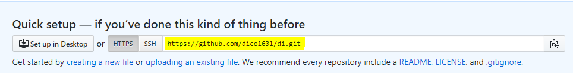

# CLI

> 커맨드 라인 인터페이스
>
> 02_CLI_basic 파일을 다운 받아 같이 보면 도움이 됩니다.

#### 터미널 명령어들

- `ls`  : 디렉토리 내 구성 리스트 출력
- `pwd`  : print working directory 현재 내 위치 알기
  - 첫 pwd 했을 때 위치가 home directory : /c/users > ~ 이 이 폴더 의미
- `mkdir` [폴더명] : 폴더 생성
- `cd` [폴더명] : 폴더 변경
- `cd ..`  :  상위 폴더로 이동
  - `..` 은 상위 폴더를 의미
- `git init`  : git 시작
  - Initialized empty Git repository in C:/Users/student/.git/   가 나옴
  - `.git`  : `. `[폴더명] 은 숨김 폴더를 의미. `ls`로는 보이지 않음
- `ls -a`  : 숨김 폴더까지 전부 보기
- `git status`  : 상태 확인하기
- `touch` [파일명] : 파일 만들기
- `rm` [파일명] : 파일 지우기
- `git remote add`[원격저장소 별명] [복사한 github의 repository 주소] : 원격저장소 만드는 방법
  - 보통 첫 원격저장소의 별명은 origin 이라고 함
- `git remote -v` : 원격 저장소 확인
- `git push ` [원격저장소 별명] [master] : 원격 저장소에 내 파일들 올리기


#### 단축키

- tab키 : 자동완성, 아래 코드들을 연습할 때 파일명을 다 치지 말고 이 단축키 이용할 것


---

---

# git / github 사용법

> 주의사항
>
> 1. 파일 2개는 typora 라는 파일로 공부 내용 적어둔 파일입니다. typora로 파일 2개를 만든 후 따라해보세요.
>
>    파일명: 
>
>    ​	1) 00_markdown_basic.md
>
>    ​	2) 01_cli.md
>
> 2.  아래 코드에 #은 주석이므로 코딩할 때에는 빼고 타이핑합니다.
>
> 3. 입력하는 코드는 $ 옆에 써있는 한 줄만이며, 그 아래 나와있는 내용은 해당 코드를 실행하면 나오는 결과입니다.

### 1. 기본 세팅 및 설명

```shell
#은 단순 설명을 위한 주석. 코드가 아님

#git이 잘 깔렸는지 확인 (버전 확인)
student@M15035 MINGW64 ~
$ git --version
git version 2.24.1.windows.2

#공부 한 내용을 넣을 파일을 만들기(today I Learned)
student@M15035 MINGW64 ~
$ mkdir TIL 

#TIL 파일로 이동
student@M15035 MINGW64 ~
$ cd TIL/

#TIL 파일에 git 시작 ** 꼭 TIL 파일(빈 파일)에서 시작해야함
#git은 폴더 단위로 관리를 하기 때문에 빈 파일에 넣지 않으면 다 자기가 관리해야 하는 파일로 인식한다.
#따라서 home directory에서 시작시키면 안됨
student@M15035 MINGW64 ~/TIL
$ git init
Initialized empty Git repository in C:/Users/student/TIL/.git/

#git을 숨김 폴더로 만들었기 때문에 확인하려면 ls -a 해야함
student@M15035 MINGW64 ~/TIL (master)
$ ls

student@M15035 MINGW64 ~/TIL (master)
$ ls -a
./  ../  .git/

#git 상태 확인
student@M15035 MINGW64 ~/TIL (master)
$ git status
On branch master

No commits yet

nothing to commit (create/copy files and use "git add" to track)

#a.txt 파일 만들어보고 확인
student@M15035 MINGW64 ~/TIL (master)
$ touch a.txt

student@M15035 MINGW64 ~/TIL (master)
$ ls
a.txt

#만들었던 a.txt 지우고 확인
student@M15035 MINGW64 ~/TIL (master)
$ rm a.txt

student@M15035 MINGW64 ~/TIL (master)
$ ls
```


### 2. 만든 파일 git에 올리기


#### 	1. add

```shell
#git은 폴더 단위로 버전을 관리한다.
#버전 관리한다는 것은 현 상태를 스냅샷 찍는 것 같이 관리한다.
#현 상태의 모습을 사진대에 올리고 (add) 스냅샷을 찍는 (commit) 느낌
#사진대 : staging area

#사진대에 파일을 올린다.
student@M15035 MINGW64 ~/TIL (master)
$ git add 00_markdown_basic.md

#git 상태 확인
#add가 되면 '00_markdown_basic.md'가 초록색으로 바뀜
student@M15035 MINGW64 ~/TIL (master)
$ git status
On branch master

No commits yet

Changes to be committed:
  (use "git rm --cached <file>..." to unstage)
        new file:   00_markdown_basic.md
```


	#### 	2. commit - 처음

```shell
#스냅샷 찍어서 저장해보기

#실패 화면
student@M15035 MINGW64 ~/TIL (master)
$ git commit

*** Please tell me who you are. #나는 너가 누군지 몰라

Run

  git config --global user.email "you@example.com"
  git config --global user.name "Your Name"

to set your account's default identity.
#최소한 너의 이메일과 이름은 알려줘

Omit --global to set the identity only in this repository.

fatal: unable to auto-detect email address (got 'student@M15035.(none)')

#시킨대로 이름과 이메일 설정
student@M15035 MINGW64 ~/TIL (master)
$ git config --global user.email "dicoqnfkrzl@naver.com"

student@M15035 MINGW64 ~/TIL (master)
$ git config --global user.name "Min Jung"

student@M15035 MINGW64 ~/TIL (master)
$ git config --global user.email
dicoqnfkrzl@naver.com

student@M15035 MINGW64 ~/TIL (master)
$ git config --global user.email
dicoqnfkrzl@naver.com

#성공 화면
#절대 git commit 하고 엔터치지 말기!!!
#잘못해서 git commit만 해서 이상한 곳에 들어가면 Exc 버튼 3번 누르고 `:q` 하면 빠져나옴
student@M15035 MINGW64 ~/TIL (master)
$ git commit -m "first commit"
[master (root-commit) 0006544] first commit
 1 file changed, 170 insertions(+)
 create mode 100644 00_markdown_basic.md
 
 #commit한 것 확인하기
 student@M15035 MINGW64 ~/TIL (master)
$ git log
commit 000654421782e43cf3b096e24402bbea0fdfdd7c (HEAD -> master)
Author: Min Jung <dicoqnfkrzl@naver.com> #누가
Date:   Mon Dec 16 17:15:28 2019 +0900 #언제

    first commit #무엇을 추가했는지 알려줌

```


#### 	3. commit - 두 번째

```shell
#2번째 파일 git에 등록해보기

#git 현 상태 확인
student@M15035 MINGW64 ~/TIL (master)
$ git status
On branch master
Untracked files:
  (use "git add <file>..." to include in what will be committed)
        01_cli.md

nothing added to commit but untracked files present (use "git add" to track)

#add
student@M15035 MINGW64 ~/TIL (master)
$ git add 01_cli.md

#git 현 상태 확인
student@M15035 MINGW64 ~/TIL (master)
$ git status
On branch master
Changes to be committed:
  (use "git restore --staged <file>..." to unstage)
        new file:   01_cli.md

#commit
student@M15035 MINGW64 ~/TIL (master)
$ git commit -m "add 01_cli.md"
[master 5d8db9c] add 01_cli.md
 1 file changed, 165 insertions(+)
 create mode 100644 01_cli.md

 #commit한 것 확인하기
student@M15035 MINGW64 ~/TIL (master)
$ git log
commit 5d8db9c15de96192933e23c13a19fe996896a370 (HEAD -> master)
Author: Min Jung <dicoqnfkrzl@naver.com>
Date:   Mon Dec 16 17:20:24 2019 +0900

    add 01_cli.md

commit 000654421782e43cf3b096e24402bbea0fdfdd7c
Author: Min Jung <dicoqnfkrzl@naver.com>
Date:   Mon Dec 16 17:15:28 2019 +0900

    first commit


```


### 3. 내 git을 github에 올리기

#### 	github란?

​	내가 올린 내용을 많은 사람들이 볼 수 있고 공유도 하고, 나도 내 코드와 파일들을 관리 하기 쉽도록 만들어진 사	이트. 개발자의 이력서/포트폴리오로 사용된다.

#### 	github에 올리는 이유는?

1. 원격 저장소인 github에 올림으로써 매번 코딩할 때마다 '해당 파일을 저장, 압축, 이메일로 전송 & 다운, 코드 복사, 개발도구에 넣기' 등 일렬의 귀찮은 과정을 하지 않고, github에 로그인해서 그 파일을 받아볼 수 있는 편리함이 있다.
2. 취업의 이력서로써 도움이 된다.
3. 다양한 사람들과 공유함으로써 더 질이 높은 파일을 만들 수 있다.


#### github에 올리기

##### 1. github 사이트에서 new repository 만들기

1. 사이트 우측 상단에 `+` 버튼 누르기    

2. New Repository
3. Repository name에 TIL 쓰고 다른 것 변경 없이 create repository
4. 해당 repository 주소 복사 (노란 부분)

 


##### 2. git에 아래 코드 계속 진행

```shell
#원격 저장소를 통해 매번 이메일로 내 코드를 전송하지 않고, github에 접속만 하면 볼 수 있도록 만든다.
#원격 저장소에 관련된 CLI는 remote가 들어간다.

#origin은 원격저장소 별명, 관련 내용은 상단 CLI에서 확인하기
#origin 뒤에는 복사해 온 주소
student@M15035 MINGW64 ~/TIL (master)
$ git remote add origin https://github.com/dico1631/TIL.git

#remote 잘 되었는지 확인
student@M15035 MINGW64 ~/TIL (master)
$ git remote -v
origin  https://github.com/dico1631/TIL.git (fetch)
origin  https://github.com/dico1631/TIL.git (push)

#원격 저장소에 파일 저장(push)
student@M15035 MINGW64 ~/TIL (master)
$ git push origin master
Enumerating objects: 9, done.
Counting objects: 100% (9/9), done.
Delta compression using up to 8 threads
Compressing objects: 100% (8/8), done.
Writing objects: 100% (9/9), 9.68 KiB | 4.84 MiB/s, done.
Total 9 (delta 1), reused 0 (delta 0)
remote: Resolving deltas: 100% (1/1), done.
To https://github.com/dico1631/TIL.git
 * [new branch]      master -> master

```


